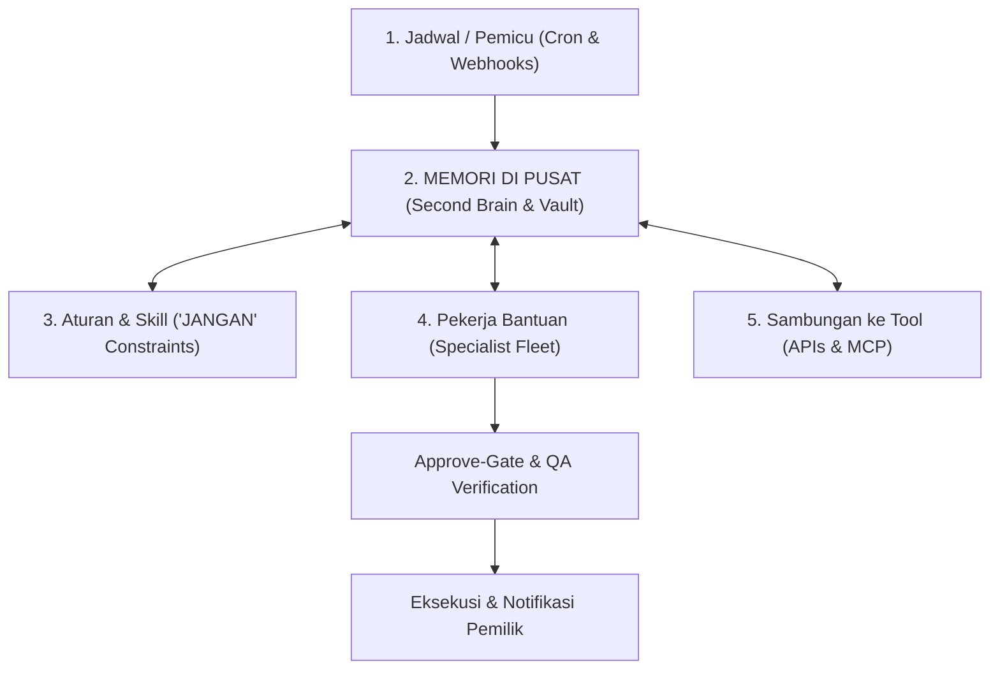

# Andreas Tobing AI Agent System Architecture & Implementation Guide
> **Sumber Analisis**: [andreasrtobing.com](https://www.andreasrtobing.com/) & [Andreas Tobing Blog](https://www.andreasrtobing.com/blog)
> **Integrasi Sistem**: ATLAS AI OS — Multi-Agent Fleet & Loop Engineering Subsystem

---

## 1. Filosofi Inti: Loop Engineering vs One-Off Prompting

> *"Pakai ChatGPT biasa itu kayak kerja sekali. Loop engineering itu mesin yang dinyalain sekali dan jalan sendiri tiap hari pas kalian tidur."*

Dalam arsitektur bisnis otonom Andreas Tobing, sistem AI tidak diperlakukan sebagai antarmuka tanya-jawab biasa (*conversational UI*), melainkan sebagai **Autonomous Event Loop (Loop Engineering)**.

---

## 2. Lima Pilar Loop Engineering

### 1. Jadwal / Pemicu (*Event Triggers*)
- **Time-Based (Jadwal)**: Cron jobs yang mengeksekusi tugas otomatis tanpa intervensi manual (contoh: *Sage* briefing finansial harian setiap pukul 07:00 WIB).
- **Event-Based (Kejadian)**: Webhooks yang langsung bereaksi terhadap event eksternal (contoh: webhook pembayaran masuk yang langsung memicu pembuatan akses course dan invoice dalam <5 menit).

### 2. Memori di Pusat (*Central Memory & Second Brain*)
- **Pusat dari Segala Komponen**: Menghilangkan amnesia AI antar-sesi.
- **Knowledge Vault**: Catatan berbasis Markdown dengan sitasi Obsidian `[[Note#Section]]`.
- **Episodic & Procedural Memory**: Menyimpan performa hook konten terbaik, data preferensi pelanggan, dan riwayat keputusan sebelumnya.

### 3. Aturan & Skill (*Constraints & Skills Library*)
- **Negative Constraints ("JANGAN")**: Batasan keras yang menjamin keamanan saat agen ditinggal tidur (contoh: dilarang memberikan diskon sepihak, dilarang mengirim pesan tanpa persetujuan).
- **Domain Skills**: Standard Operating Procedures (SOP) yang terenkapsulasi dalam dokumen instruksi terstruktur.

### 4. Pekerja Bantuan (*Specialist Fleet & Sub-Orchestration*)
- Memecah masalah kompleks menjadi tanggung jawab spesifik per agen.
- Agen tidak saling tumpang tindih; orkestrator mendelegasikan tugas dan menyatukan hasilnya.

### 5. Sambungan ke Tool (*Tool Integrations & MCP*)
- Menghubungkan agen ke dunia nyata: Telegram, Redis Task Queue, PostgreSQL, Webhook Payment, dan REST API.

---

## 3. Pemetaan Fleet: Andreas Tobing Fleet vs ATLAS AI OS

| Andreas Tobing Fleet | Peran & Tanggung Jawab | Ekuivalen di ATLAS AI OS | Implementasi Teknis |
| :--- | :--- | :--- | :--- |
| **Kenara** | Top-Level Fleet Orchestrator | **Chief** | Orkestrasi tujuan, dekomposisi rencana, pendelegasian kedalaman 0-2. |
| **Course Orchestrator** | Sub-Orchestrator modul & materi | **Task Execution Engine** | Parent-child task graph dengan dependency order. |
| **Tom** | Payment verification & invoice | **Worker & Webhook Handler** | Atomic intake & transaction auditing. |
| **Sage** | Daily Finance Briefing (07:00) | **Cron Scheduler & Hermes** | Automated daily budget & revenue ledger synthesis. |
| **CS1** | Customer Service & triage | **Hermes + Telegram Bot** | Multi-channel communication & draft preparation. |
| **Andre BOT** | 24/7 Member Q&A Tutor | **Second Brain RAG (/brain)** | Hybrid semantic vector search + MiniMax OpenRouter LLM. |
| *(QA Guard)* | Approve-Gate ("Biar AI Gak Ngawur") | **Argus** | Dual-gate QA verification, fact-checking, zero-fabrication check. |
| *(Research)* | Market & Tech Researcher | **Ned** | Safe web search, source tracking, factual citation. |
| *(Lead Scoring)* | Sales Qualification | **Layla** | Multi-dimensional ICP scoring & qualification rubrics. |

---

## 4. Approve-Gate & Protokol Keamanan ("Biar AI Gak Ngawur")

Prinsip krusial dalam arsitektur Andreas Tobing adalah **Approve-Gate**:
1. **Draft First**: Semua aksi komunikasi eksternal dan perubahan finansial dibuat sebagai *DRAFT*.
2. **Argus QA Audit**: Dokumen diverifikasi terhadap 6 axis (Factuality, Scope Fidelity, Language Purity, Math, Tone, Policy).
3. **One-Time Token Approval**: Aksi bernilai tinggi membutuhkan token persetujuan eksplisit dari pemilik sistem sebelum dikirim.

---

## 5. Rekomendasi Operasional 24/7

1. **Self-Hosted 24/7 Server**: Jalankan worker menggunakan daemon launcher (`node scripts/dev.mjs` atau Docker container).
2. **Heartbeat Monitoring**: Agen worker memancarkan heartbeat setiap 30 detik ke Redis/Postgres.
3. **Graceful Fail-Closed**: Jika provider LLM atau koneksi terputus, sistem beralih ke extractive fallback tanpa mengalami crash.
