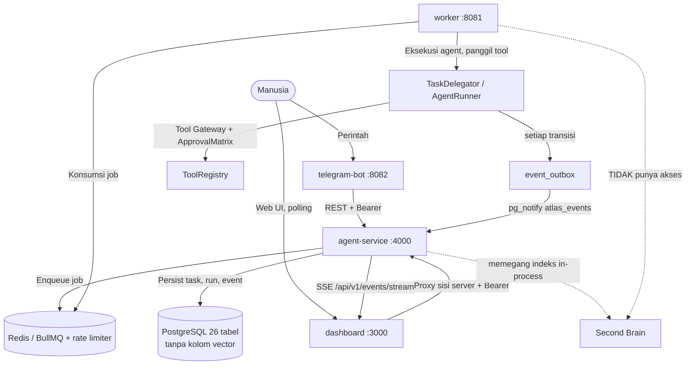

# 🏛️ System Architecture MOC

Peta navigasi arsitektur **ATLAS AI OS**. Sistem adalah runtime multi-agent dengan satu
titik masuk (Chief), gerbang tool terkontrol, eksekusi tahan lama berbasis antrian, dan
aliran event persisten.

> Semua klaim teknis diberi anchor `path:line` di catatan masing-masing dan sudah
> diverifikasi pada **16 Sep 2026**. Ringkasan cacat yang diketahui ada di
> [[Implementation Status & Known Gaps]].

---

## 📑 Catatan Arsitektur

1. [[ATLAS AI OS Blueprint]] — Ringkasan eksekutif, prinsip arsitektur, komponen inti, dan kondisi nyata hari ini.
2. [[Monorepo Layout & Applications]] — Struktur `apps/` dan `packages/`, daftar rute API yang benar-benar terdaftar, halaman dashboard, dan skrip akar.
3. [[Task & Execution Pipeline]] — **Catatan alur kanonik**: intake → BullMQ → planning → delegasi DAG → AgentRunner → QAGate → sintesis → event → SSE, termasuk semua jalur gagal.
4. [[Second Brain & Grounded RAG]] — Ingesti vault, chunking, embedding, penyimpanan `Map` in-process, skor hibrida, dan keterputusan antar proses.
5. [[Policy, Security & Approval Gates]] — Gerbang tool berlapis, `ApprovalMatrix`, token persetujuan HMAC, perlindungan fetch eksternal, dan celah audit.
6. [[Observability & Audit Trail]] — Log terstruktur, `event_outbox` + `pg_notify` + SSE, audit append-only, dan pemantauan biaya.
7. [[Implementation Status & Known Gaps]] — Daftar cacat terverifikasi (boot-blocker migrasi, cron ganda, anggaran inert, Second Brain terputus) beserta prioritas perbaikan.

---

## 🔄 Hubungan Antar Komponen

Tiga hal yang paling mudah salah dipahami, dan karena itu digambar eksplisit di atas:

1. **Agent tidak berada di agent-service.** Agent berjalan di `worker`
   (`apps/worker/src/worker.ts:266`), sementara agent-service hanya menulis job ke Redis
   (`apps/agent-service/src/index.ts:31-33`).
2. **Garis putus-putus ke Second Brain.** Indeksnya hidup di memori proses agent-service
   (`packages/memory/src/second-brain/vault-ingestion-service.ts:25-26`) dan toolnya tidak
   didaftarkan di worker (`apps/worker/src/worker.ts:100-129`), sehingga agent tidak dapat
   melakukan grounding ke vault ini.
3. **Tidak ada pgvector dan tidak ada Redis pub/sub.** Penyimpanan vektor belum pernah ada
   (0 kolom bertipe `vector`); aliran event memakai `event_outbox` + `pg_notify`.

Gerbang persetujuan **tidak mengirim notifikasi ke manusia** — ia menghentikan run, melepas
lease, dan menunggu manusia memeriksa lewat `/status` atau halaman `/approvals`
(`packages/orchestration/src/engine/agent-runner.ts:534-547`).

---

## 🧭 Ke Mana Selanjutnya

| Ingin tahu tentang | Buka |
| :--- | :--- |
| Alur satu task dari awal sampai akhir | [[Task & Execution Pipeline]] |
| Nama rute API dan halaman dashboard | [[Monorepo Layout & Applications]] |
| Siapa agent-nya dan apa batasnya | [[020 - Agent Fleet MOC]] |
| Cara menjalankan & memulihkan sistem | [[030 - Operations & Runbooks MOC]] |
| Cacat yang belum diperbaiki | [[Implementation Status & Known Gaps]] |

---

⬅️ Kembali ke [[000 - Home MOC]]
