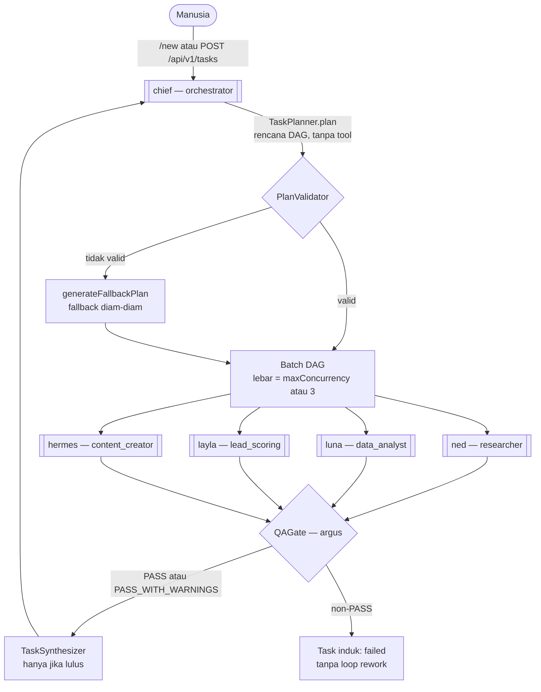

# 🤖 Agent Fleet MOC

Peta navigasi armada agent **ATLAS AI OS**. Sistem menganut prinsip **Single Root
Orchestrator**: manusia hanya berinteraksi dengan **Chief**, yang memecah goal menjadi
rencana lalu mendelegasikan subtask ke spesialis.

Sumber kebenaran roster: `packages/agents/src/registry.ts:12-19` — **6 agent**, bukan 5.

---

## 👥 Profil Armada Agent (Enterprise 3-Tier Roster)

| Agent | Peran (`role`) | Spesialisasi | Batas eksekusi | Detail |
| :--- | :--- | :--- | :--- | :--- |
| **CEO** | `ceo` | Penyelarasan visi bisnis, perumusan Strategic Brief & OKRs | 10 turn / 180 s / $0.80 | [[CEO - Chief Executive Officer]] |
| **CTO** | `cto` | Arsitektur teknis, evaluasi alat, kebijakan keamanan | 10 turn / 150 s / $0.60 | [[CTO - Chief Technology Officer]] |
| **CFO** | `cfo` | Kelayakan modal, unit economics, Budget Envelope, hak veto | 8 turn / 120 s / $0.50 | [[CFO - Chief Financial Officer]] |
| **Chief (COO)** | `orchestrator` | Perencanaan operasional, penjadwalan DAG, sintesis akhir | 15 turn / 180 s / $1.00 | [[Chief - System Orchestrator]] |
| **Ned** | `researcher` | Riset web, enrichment prospek/perusahaan, pengumpulan bukti | 10 turn / 180 s / $0.75 | [[Ned - Research Specialist]] |
| **Luna** | `data_analyst` | Analisis dataset, perbandingan tarif/pasar, pemodelan tren | 10 turn / 180 s / $0.75 | [[Luna - Data & Market Analyst Specialist]] |
| **Layla** | `lead_scoring` | Kualifikasi prospek berbasis rubrik deterministik, peringkat lead | 8 turn / 180 s / $0.50 | [[Layla - Lead Scoring Specialist]] |
| **Hermes** | `content_creator` | Draf komunikasi, agenda rapat, copywriting outreach, dokumentasi | 8 turn / 180 s / $0.50 | [[Hermes - Content Specialist]] |
| **Argus (CRO)** | `qa_verifier` | Verifikasi kepatuhan & risiko, penentu kelulusan QA Gate | 6 turn / 120 s / $0.35 | [[Argus - QA & Risk Gate Specialist]] |

---

## 🔀 Topologi Delegasi yang Sebenarnya

Perbedaan penting dari versi lama catatan ini:

1. **Argus bukan pra-eksekusi.** `QAGate` dievaluasi **setelah** tiap subtask selesai dan
   bersifat terminal (`packages/orchestration/src/qa/qa-gate.ts:26`,
   `packages/orchestration/src/delegator/task-delegator.ts:353-371`).
2. **Tidak ada tepi tetap Ned → Luna.** Rencana disusun planner dan dieksekusi per batch
   DAG; hubungan antar spesialis ditentukan isi rencana, bukan diagram tetap.
3. **Luna belum pernah dieksekusi** (0 run). Kehadirannya di roster bukan berarti ia pernah
   dipakai.
4. **Kedalaman delegasi belum ditegakkan.** `DepthGuard` ada dan dipanggil
   (`task-delegator.ts:174-179`), tetapi `depth` anak dihitung di `:203` dan tidak pernah
   dipersistensi `taskRepo.create` — seluruh 55 task di database berstatus `depth = 0`.

---

## ⚙️ Fakta Lintas-Agent yang Berlaku untuk Semua

- **Batas yang benar-benar ditegakkan**: `maxTurns`, `timeoutSeconds`, `maxCostUsd`.
- **Konfigurasi yang tidak berpengaruh**: `modelPolicy.temperature` dan
  `modelPolicy.fallbackTier` — `AgentRunner` tidak pernah meneruskan `temperature`/`maxTokens`
  ke provider, sehingga seluruh agent efektif memakai default provider 0.2. `modelPolicy`
  memang dipersistensi ke kolom `model_policy` (`packages/database/src/agent-seeder.ts:7`) tetapi
  tidak dibaca saat eksekusi.
- **Tool yang tidak pernah terdaftar di worker** (pemanggilannya akan gagal): seluruh
  `second_brain.*`, seluruh `tasks.*`, `approvals.request`, dan `brand.get_voice`
  (`apps/worker/src/worker.ts:100-129`).
- **Registry tool di worker dibangun tanpa `eventBus`**, sehingga tidak ada event `tool.*`
  yang pernah muncul di `event_outbox`.
- **Tahap planner, QA, dan synthesizer berjalan tanpa `toolExecutor`**
  (`task-delegator.ts:72-81`).
- **Riwayat kegagalan didominasi kredensial**: 27 dari 36 run gagal karena `OpenRouter HTTP
  401` atau `MODEL_API_KEY_MISSING`.

---

## 🏷️ Indeks Tag Armada

`#agent` `#agents` `#fleet` `#chief` `#orchestrator` `#ned` `#research` `#luna` `#analytics`
`#layla` `#lead-scoring` `#sales` `#hermes` `#content` `#argus` `#qa` `#risk`

> Tag berbentuk namespace (`#agent/chief`) **tidak dipakai** di vault ini; setiap catatan
> agent memakai tag datar seperti `tags: [agent, chief, orchestrator, fleet]`.

---

## 🔗 Navigasi

- [[000 - Home MOC]]
- [[010 - System Architecture MOC]] — alur teknis lengkap
- [[Task & Execution Pipeline]] — bagaimana subtask benar-benar dibuat dan dieksekusi
- [[Implementation Status & Known Gaps]] — cacat yang memengaruhi armada

---

⬅️ Kembali ke [[000 - Home MOC]]
