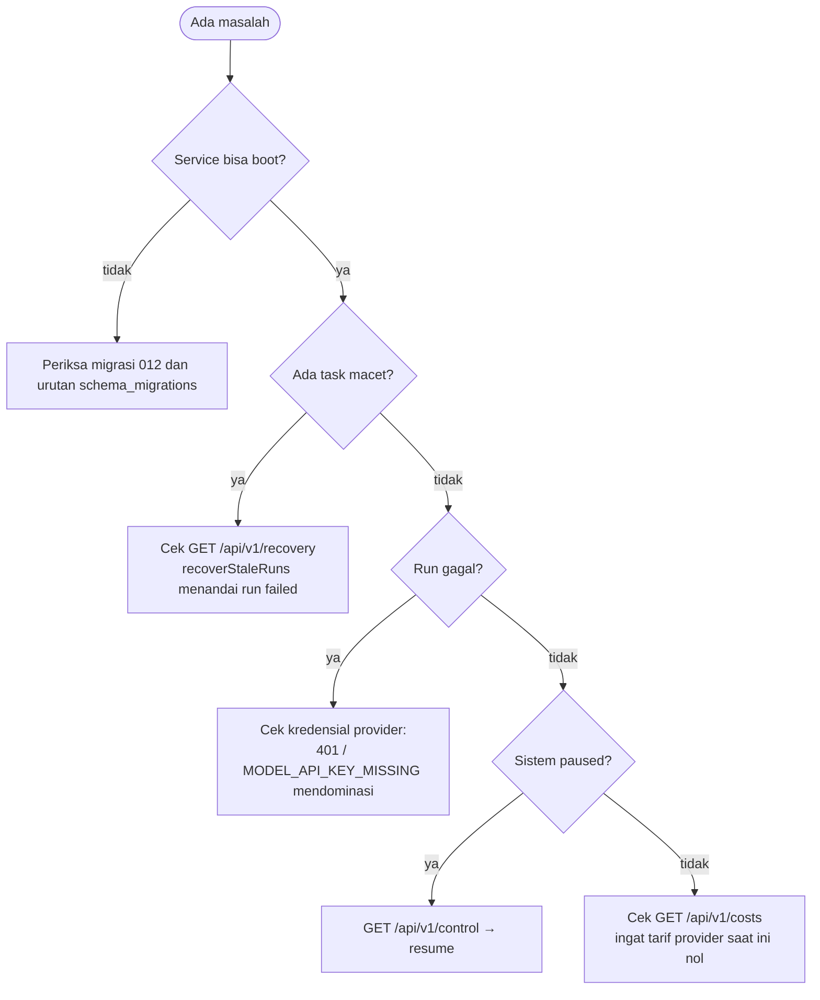

# 🛠️ Operations & Runbooks MOC

Peta navigasi prosedur operasional, pemeliharaan, pemulihan, dan deployment **ATLAS AI OS**.

> Semua perintah di halaman ini memakai **pnpm** (proyek menetapkan `packageManager: pnpm@11.23.0`),
> bukan `npm`. Rincian perintah ada di [[Local Development Setup]].

---

## 📋 Daftar Runbook

1. [[Local Development Setup]] — Menjalankan stack secara native: PostgreSQL 16 + Redis 7 lewat Docker, lalu tiga proses Node (`agent-service`, `worker`, `telegram-bot`) plus dashboard. Termasuk peringatan bahwa `pnpm brain:sync` hanya mengisi memori proses agent-service.
2. [[Production Deployment & Docker]] — Delapan layanan pada `docker-compose.prod.yml`, reverse proxy Caddy, healthcheck, dan variabel lingkungan wajib.
3. [[Database Migrations & pgvector Setup]] — Advisory lock migrasi, struktur `schema_migrations`, urutan migrasi `001`–`014`, dan **cacat fatal** pada `012_scheduled_jobs.sql` yang membuat host bersih gagal boot. Catatan: `pgvector` **tidak pernah aktif**.
4. [[Disaster Recovery & Lease Watchdog]] — Lease 60 detik dengan heartbeat 30 detik, `recoverStaleRuns`/`recoverQueuedTasks`, prosedur backup & restore, dan status task macet.

---

## ⚡ Checklist Cepat Operasional

**Verifikasi lingkungan (tanpa menjalankan service):**
```bash
pnpm dev:check
```

**Jalankan seluruh stack pengembangan:**
```bash
pnpm dev
```

**Sinkronkan vault ke indeks Second Brain:**
```bash
pnpm brain:sync
```
> ⚠️ Efeknya hanya pada proses **agent-service** dan hilang saat proses itu dimatikan.
> Agent yang berjalan di worker tidak melihat hasilnya — lihat [[Second Brain & Grounded RAG]] §6.

**Verifikasi kualitas:**
```bash
pnpm typecheck
pnpm test
pnpm lint
```

---

## 🚦 Urutan Diagnosa Saat Ada Masalah



Detail tiap langkah ada di [[Disaster Recovery & Lease Watchdog]] dan
[[Observability & Audit Trail]].

---

## 🔗 Navigasi

- [[000 - Home MOC]]
- [[010 - System Architecture MOC]]
- [[Implementation Status & Known Gaps]]

---

⬅️ Kembali ke [[000 - Home MOC]]
