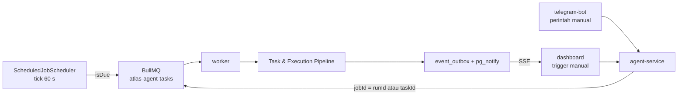

# ⚡ Automations & Workflows MOC

Peta navigasi otomasi mandiri, penjadwalan berbasis cron, dan jalur kontrol pengguna pada
**ATLAS AI OS**.

---

## 📑 Catatan Otomasi

1. [[Scheduled Jobs & Cron Automations]] — Arsitektur background scheduler, tabel `scheduled_jobs`, tick 60 detik, dan **bug fatal pemuatan `cron-parser`** yang membuat setiap job menembak berulang tiap tick.
2. [[Telegram Bot Command Reference]] — Daftar perintah yang benar-benar dikenali (termasuk `emergency_stop` bergaris bawah), mekanisme polling `getUpdates`, dan kenyataan bahwa approval tidak punya tombol interaktif.

---

## 🔁 Alur Otomasi End-to-End

Tiga jalur masuk di atas bermuara pada pipeline yang sama — detailnya ada di
[[Task & Execution Pipeline]].

---

## 📊 Status Otomasi Hari Ini

| Komponen | Status |
| :--- | :--- |
| `ScheduledJobScheduler` | ⚠️ berjalan, tetapi **bug** membuat `nextRunAt` selalu `null` → job dieksekusi tiap tick |
| `scheduled_jobs` | 0 baris (16 Sep 2026) — risiko laten, belum aktif |
| `AUTOMATION_ENABLED` / `WORKFLOW_AUTOMATION_ENABLED` | keduanya default `true` (`packages/shared/src/schemas/config.ts:60-61`) |
| `worker-automation` (Docker) | terdefinisi dengan profil `automation`, opt-in, skala replika terpisah |
| `workflow_checkpoints` | tabel ada (migrasi 014) tetapi **inert**, 0 baris |
| Perintah Telegram | 14 perintah nyata, tidak ada tombol inline, manusia harus polling |

---

## 🔗 Navigasi

- [[000 - Home MOC]]
- [[010 - System Architecture MOC]]
- [[Task & Execution Pipeline]]
- [[Implementation Status & Known Gaps]]

---

⬅️ Kembali ke [[000 - Home MOC]]
