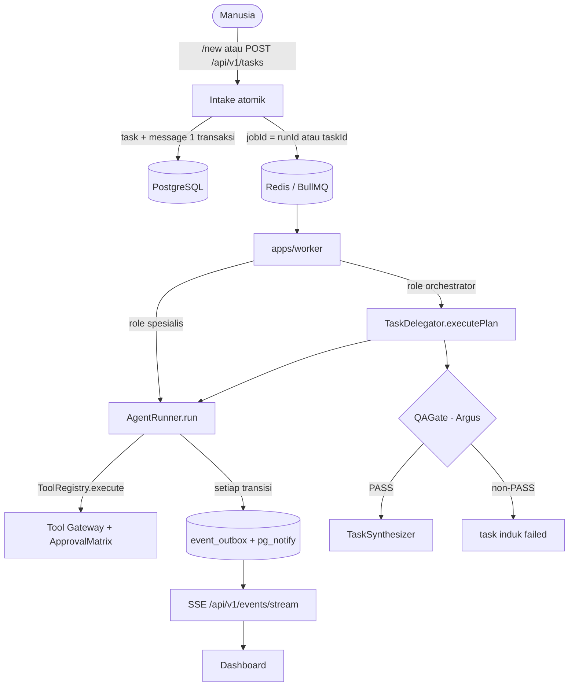

# 🏛️ ATLAS AI OS — Implementation Blueprint

> Dokumen ini adalah peta tingkat tinggi. Setiap klaim teknis di sini punya rujukan kode
> (`path:line`) dan sudah diverifikasi langsung terhadap repositori pada **16 Sep 2026**.
> Rincian alur ada di [[Task & Execution Pipeline]]; daftar cacat yang diketahui ada di
> [[Implementation Status & Known Gaps]].

## 1. Ringkasan Eksekutif

**ATLAS AI OS** adalah sistem operasi personal multi-agent di mana manusia berkomunikasi
melalui satu pintu masuk: **[[Chief - System Orchestrator|Chief]]**.

Secara arsitektur, sistem ini adalah runtime terstruktur dengan:

- **Tanggung Jawab Spesifik** — 6 agent (`chief`, `ned`, `luna`, `layla`, `hermes`, `argus`)
  masing-masing punya system prompt, `limits`, dan allowlist tool sendiri
  (`packages/agents/src/registry.ts:12-19`).
- **Orkestrasi Hierarkis** — Chief memecah goal menjadi rencana DAG, lalu mendelegasikan
  subtask ke spesialis lewat `TaskDelegator.executePlan`
  (`packages/orchestration/src/delegator/task-delegator.ts:111`).
- **Gerbang QA** — seluruh hasil dilewatkan `QAGate` (Argus) sebelum disintesis
  (`packages/orchestration/src/qa/qa-gate.ts:26`).
- **Eksekusi Tahan Lama** — task & run dipersistensi di PostgreSQL, dieksekusi lewat
  antrian BullMQ/Redis, dengan lease 60 detik per run
  (`packages/orchestration/src/engine/agent-runner.ts:148`).
- **Keamanan Fail-Closed** — `ApprovalMatrix` menolak aksi berisiko atau tidak dikenal
  (`packages/policy/src/approval-matrix.ts:34-49`), dan `EXTERNAL_WRITES_ENABLED`
  default `false` (`packages/shared/src/schemas/config.ts:66`).
- **Observabilitas** — event ditulis ke `event_outbox`, dipublikasikan ulang lewat
  `pg_notify`, dan dialirkan ke dashboard via SSE
  (`packages/events/src/bus.ts:63-82`).

### 1.1 Kondisi nyata hari ini (jujur, bukan aspirasi)

| Aspek | Keadaan terverifikasi |
| :--- | :--- |
| Agent terdaftar | 6 — tetapi **Luna belum pernah dieksekusi** (0 run) |
| Run tercatat | 106 (70 `completed`, 36 `failed`) — jendela data 28 Agu → 3 Sep 2026 |
| Penyebab kegagalan dominan | **27 dari 36** kegagalan adalah masalah kredensial provider |
| Pemanggilan tool | 5 seumur platform (`memory.search` ×3, `artifacts.write` ×1, `artifacts.read` ×1) |
| Biaya tercatat | $0.0130 — dan sejak 3 Sep selalu $0.0000 karena tarif provider di-hardcode nol |
| Second Brain | indeks in-process, bukan vektor persisten, dan **tidak terjangkau agent** |
| Migrasi di host bersih | **gagal** pada `012_scheduled_jobs.sql`, membatalkan `013`/`014` |
| Cron scheduler | **tembak berulang setiap tick** karena bug pemuatan `cron-parser` |

Angka lengkap ada di [[Implementation Status & Known Gaps]].

---

## 2. Prinsip Arsitektur

### 2.1 Single Root Entry Point
Pengguna tidak memilih agent. Pesan masuk lewat Telegram `/new <goal>`
(`apps/telegram-bot/src/handlers/commands.ts:159`) atau `POST /api/v1/tasks`
(`apps/agent-service/src/routes/tasks.ts:32`); task selalu dibuat dengan
`assignedAgent: 'chief'` dan `depth: 0`. Worker memilih jalur berdasarkan **role**:
`role === 'orchestrator'` (hanya Chief) → `TaskDelegator.executePlan`, selain itu
`AgentRunner.run` (`apps/worker/src/worker.ts:294-304`).

### 2.2 Controlled Tool Gateway
Agent tidak memanggil fungsi sembarangan. Semua pemanggilan melewati `ToolRegistry.execute`
dengan validasi Zod, dan tiga lapis penolakan berurutan
(`packages/tools/src/registry.ts:138-162`):
1. tool tidak terdaftar → `Tool '<x>' not found in Tool Gateway registry.`;
2. di luar allowlist agent → `Tool '<x>' is not permitted for agent '<y>'.`;
3. `ApprovalMatrix.evaluate` → blokir keras atau wajib persetujuan manusia.

Level risiko tool bukan `read`/`write`/`external`, melainkan enum
`read | low | medium | high | critical` (`packages/shared/src/schemas/tool.ts:3`).

### 2.3 Resilient Worker & Leases
Lease diberikan **per run**, bukan per task, selama **60 detik**
(`packages/orchestration/src/engine/agent-runner.ts:148`), diperbarui oleh heartbeat
otomatis tiap `leaseSeconds/2` (dijepit 1000–30000 ms ⇒ 30 detik untuk lease default,
`:226`). Bila heartbeat gagal, run dibatalkan lewat `AbortSignal`
(`:228-236`). Pemulihan run terbengkalai ditangani `recoverStaleRuns()`
(`packages/database/src/repositories/run.repository.ts:207-227`) — yang menandai run
**`failed`**, bukan mengembalikannya ke antrian.

### 2.4 Fail-Closed
Aksi seperti `shell.execute`, `bash.run`, `finance.transfer`, `admin.bypass_permissions`
selalu ditolak (`packages/policy/src/approval-matrix.ts:34-40`). Aksi seperti
`communication.send_approved`, `system.deploy`, `database.write_production` wajib
persetujuan manusia dan diblokir selama `EXTERNAL_WRITES_ENABLED=false` (`:42-49`).

### 2.5 Observability by Default
Setiap transisi penting menulis baris ke `event_outbox` dalam transaksi yang sama, lalu
`pg_notify('atlas_events', ...)` (`packages/events/src/bus.ts:63-82`). **Tidak ada Redis
pub/sub**; Redis hanya dipakai BullMQ dan rate limiter API.

---

## 3. Komponen Inti

- **Inference Layer** — `packages/providers`, dibungkus `ReloadableModelProvider` yang
  membaca baris singleton di `model_provider_settings`
  (`packages/runtime/src/index.ts:91-95`, `packages/providers/src/reloadable.ts:15-30`).
  Daftar provider: `mock | openai | openai-compatible | openrouter | groq | ollama | deepseek`
  (`packages/shared/src/schemas/config.ts:4`). Lihat [[AI Model Provider Landscape]].
- **Knowledge Layer** — Second Brain di `packages/memory`. **Bukan** pgvector: chunk
  disimpan di `Map` dalam memori proses (`packages/memory/src/second-brain/vault-ingestion-service.ts:25-26`).
  Lihat [[Second Brain & Grounded RAG]].
- **Orchestration Layer** — `TaskPlanner` → `PlanValidator` → `TaskDelegator` → `AgentRunner`
  → `QAGate` → `TaskSynthesizer`, dilayani antrian BullMQ
  (`packages/orchestration/src/queue/bullmq-task-queue.ts:18-31`).
- **Data Layer** — PostgreSQL 26 tabel, migrasi `001`–`014` (`packages/database/src/migrations/`)
  dengan advisory lock `2147483646` (`packages/database/src/migrator.ts:6`).
- **Event Layer** — `event_outbox` + `pg_notify` + SSE
  (`apps/agent-service/src/routes/events.ts:32-81`).

---

## 4. Alur End-to-End (ringkas)

Detail lengkap tiap tahap — termasuk nomor baris dan jalur gagal — ada di
[[Task & Execution Pipeline]].

---

## 5. Referensi Silang

- Peta navigasi: [[010 - System Architecture MOC]]
- Tata letak kode: [[Monorepo Layout & Applications]]
- Alur eksekusi: [[Task & Execution Pipeline]]
- Keamanan: [[Policy, Security & Approval Gates]]
- Pengetahuan: [[Second Brain & Grounded RAG]]
- Pemantauan: [[Observability & Audit Trail]]
- Cacat & status: [[Implementation Status & Known Gaps]]
- Deployment: [[Production Deployment & Docker]]

---

⬅️ Kembali ke [[000 - Home MOC]]
