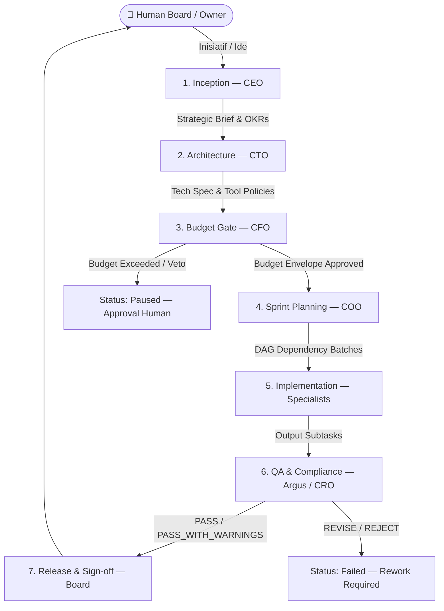

# 🏛️ Enterprise SDLC Operating System

Dokumen ini adalah **cetak biru arsitektural** untuk transformasi ATLAS AI OS menjadi sistem operasi perusahaan berbasis hierarki eksekutif (**C-Suite**) dan alur kerja terstruktur **SDLC (Software & Product Development Life Cycle)**.

Sistem beralih dari model *flat bot chatter* menjadi **Deliverable-Driven Enterprise OS** di mana setiap keputusan eksekutif dituangkan ke dalam artefak terdokumentasi (Strategic Brief, Tech Spec, Budget Envelope, Sprint DAG, QA Audit Report).

---

## 👥 Struktur Roster 3-Tier Enterprise

| Tier | Role / Agent | Tanggung Jawab Utama | Deliverable Output |
| :--- | :--- | :--- | :--- |
| **Tier 1 (C-Suite)** | **CEO** (`ceo`) | Penyelarasan visi, perumusan PRD, pemecahan tujuan bisnis | `StrategicBrief` (OKRs & Criteria) |
| **Tier 1 (C-Suite)** | **CTO** (`cto`) | Arsitektur teknis, evaluasi alat, kebijakan keamanan | `TechnicalSpec` (Tool Permissions) |
| **Tier 1 (C-Suite)** | **CFO** (`cfo`) | Audit kelayakan finansial, pagu token, unit economics | `BudgetEnvelope` (Capital Ceiling) |
| **Tier 1 (C-Suite)** | **COO / Chief** (`chief`) | Orkestrasi operasional, penjadwalan DAG, SLA antrean | `SprintPlan` (DAG Task Batches) |
| **Tier 2 (Governance)** | **Argus / CRO** (`argus`) | Audit kepatuhan, verifikasi kualitas deterministik | `QAReport` (Verdict & Score) |
| **Tier 3 (Specialists)** | **Ned** (`researcher`) | Pengumpulan data web, scraping & pengayaan bukti | Dataset & Bukti Terverifikasi |
| **Tier 3 (Specialists)** | **Luna** (`data_analyst`) | Analisis statistik, pemodelan data & query | Analisis & Visualisasi Data |
| **Tier 3 (Specialists)** | **Layla** (`lead_scoring`) | Kualifikasi prospek berbasis rubrik deterministik | Scoring & Peringkat Lead |
| **Tier 3 (Specialists)** | **Hermes** (`content_creator`)| Penyusunan draf konten, proposal & komunikasi | Draf Komunikasi & Deliverables |

---

## 🔄 Alur Kerja 7-Fase SDLC

---

## ⚡ Mesin & Provider Utama: DeepSeek 4.1 Flash (zrouter.dev)

> **Koreksi 20 Sep 2026.** Tiga angka di bagian ini sebelumnya salah dan sudah diperbaiki
> terhadap kode: nama model, tarif input, dan tarif output.
> Sumber kebenaran: `packages/providers/src/factory.ts:54-63`.

Sistem mendukung provider **zrouter.dev** yang kompatibel dengan protokol [OI]:
- **Base URL**: `https://api.zrouter.dev/v1` (`factory.ts:57`)
- **Default Model**: `deepseek-v4.1-flash` (`factory.ts:60`)
- **Unit Economics**:
  - Input Token Rate: **$0.0075** per 1M tokens (`factory.ts:61`)
  - Output Token Rate: **$0.03** per 1M tokens (`factory.ts:62`)

Catatan: `MODEL_PROVIDER` masih default `openrouter` (`packages/shared/src/schemas/config.ts:33`),
dan adapter OpenRouter meng-hardcode biaya `0` (`packages/providers/src/openrouter.ts:18-19`),
sehingga plafon harian tidak berarti selama provider default tidak diganti ke zrouter.

---

## 🔧 Implementasi: Fase SDLC Adalah Task Biasa (20 Sep 2026)

Bagian di atas adalah **cetak biru**. Berikut keadaan implementasinya, supaya pembaca tidak
menyamakan niat dengan kenyataan.

Setiap fase **bukan** panggilan model inline. Setiap fase adalah satu task yang lewat pipeline
task yang sama dengan pekerjaan lain, sehingga mewarisi reservasi anggaran, lease run,
pembatalan, audit, aliran event, dan gerbang tool.

| Fase | Agen | Artefak |
| :--- | :--- | :--- |
| `inception` | `ceo` | `StrategicBrief` |
| `architecture` | `cto` | `TechnicalSpec` |
| `budget_gate` | `cfo` | `BudgetEnvelope` |
| `sprint_planning` | `chief` | `SprintPlan` (delegator yang memecahnya) |
| `implementation` | `chief` | hasil kerja spesialis |
| `qa_compliance` | `argus` | `QAReport` |
| `release_signoff` | `chief` | paket rilis |

- `packages/orchestration/src/sdlc/sdlc-engine.ts` adalah **koordinator**, bukan eksekutor.
  `startPhase` membuat dan meng-enqueue task fase (id task dipesan lebih dulu lalu diklaim
  lewat compare-and-set pada `current_phase`, jadi satu fase tidak bisa jalan dua kali), dan
  `recordPhaseResult` membaca task yang selesai lalu memajukan inisiatif.
- `apps/worker` memanggil `recordPhaseResult` setelah setiap job. Karena itu inisiatif maju
  sebagai efek samping eksekusi task nyata, dan restart di tengah siklus tidak lagi
  meninggalkan inisiatif menggantung di satu fase.
- Prompt fase dan pembacaan hasil ada di `packages/orchestration/src/sdlc/phase-prompts.ts`.
  Parsing ketat dan gagal-tertutup: hasil fase yang tidak bisa di-parse **menjeda** inisiatif
  untuk ditinjau manusia, bukan menggantinya dengan verdict default.
- `sdlc_initiatives.phase_task_id` (migrasi `016`) adalah tautan yang dipakai worker untuk
  memetakan task selesai kembali ke inisiatifnya.

**Yang belum selesai:**
- Halaman `/board` belum punya kanal realtime, jadi perlu refresh manual saat siklus berjalan.
- `priority` dan `maxAuthorizedBudgetUsd` pada input pembuatan inisiatif masih diterima lalu
  dibuang (`CreateSDLCInitiativeInputSchema` vs `SDLCRepository.create`).
- Kebijakan tool yang ditulis CTO (`allowedTools`/`disallowedTools`) masih hanya teks prompt;
  belum ditegakkan ke `ToolContext.allowedTools`.
- Envelope anggaran (`maxAuthorizedCostUsd`) belum dibandingkan dengan belanja nyata.

---

## 🔗 Tautan Terkait
- [[020 - Agent Fleet MOC]]
- [[CEO - Chief Executive Officer]]
- [[CFO - Chief Financial Officer]]
- [[CTO - Chief Technology Officer]]
- [[Chief - System Orchestrator]]
- [[Argus - QA & Risk Gate Specialist]]
