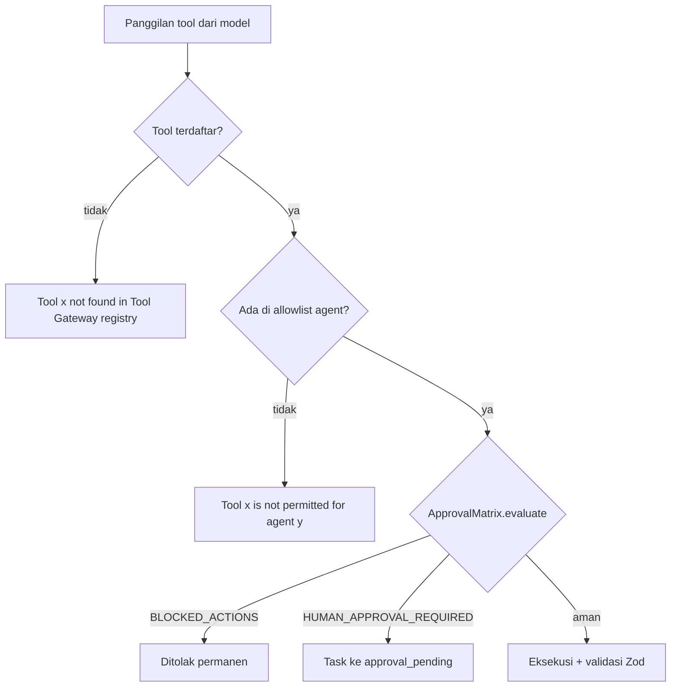

# 🛡️ Policy, Security & Approval Gates

> Diverifikasi terhadap kode pada **16 Sep 2026**. Beberapa klaim versi sebelumnya
> (level risiko `read`/`write`/`external`, TTL 15 menit, token acak, batas 2MB/5000 ms)
> sudah dikoreksi di sini.

---

## 1. Prinsip

1. **Fail-closed** — aksi berisiko atau tidak dikenal ditolak, bukan diizinkan.
2. **Least privilege per agent** — tiap agent punya allowlist tool sendiri.
3. **Human-in-the-loop** — aksi berdampak eksternal wajib persetujuan manusia.
4. **Auditable** — setiap keputusan menyentuh catatan audit tanpa rahasia mentah.
5. **Validasi skema** — input tool divalidasi Zod sebelum dieksekusi.

---

## 2. Level Risiko Tool (enum sebenarnya)

`packages/shared/src/schemas/tool.ts:3`:

```
read | low | medium | high | critical
```

Nilai default bila manifest tidak menyebutkan apa pun adalah **`read`**
(`packages/shared/src/schemas/tool.ts:16`).

> ⚠️ Versi lama catatan ini menyebut level risiko `read`, `write`, `external`.
> Trio itu **tidak ada** di kode.

---

## 3. Tiga Gerbang `ToolRegistry.execute`

`packages/tools/src/registry.ts:138-162`, dievaluasi berurutan (gerbang 1 `:142-149`,
gerbang 2 `:151-158`, gerbang 3 `:160-162`):



### 3.1 `BLOCKED_ACTIONS` — selalu ditolak, `critical`
`packages/policy/src/approval-matrix.ts:34-40`:

- `shell.execute`
- `bash.run`
- `finance.transfer`
- `finance.execute_payment`
- `admin.bypass_permissions`

### 3.2 `HUMAN_APPROVAL_REQUIRED_ACTIONS` — butuh manusia
`packages/policy/src/approval-matrix.ts:42-49`:

- `communication.send_approved`
- `communication.send_message`
- `outreach.publish_campaign`
- `database.write_production`
- `system.deploy`
- `memory.delete_canonical`

### 3.3 Flag `EXTERNAL_WRITES_ENABLED`
Default **`false`** (`packages/shared/src/schemas/config.ts:66`). Selama flag ini masih
`false` (kondisi sekarang), seluruh aksi tulis eksternal tetap terkunci. Di
`docker-compose.prod.yml` nilai itu juga di-default `false`.

### 3.4 Metadata bawaan untuk tool lama

`registerLegacy` (`packages/tools/src/registry.ts:86-110`) menyintesis metadata untuk tool
yang tidak punya manifest:

```
capability:  'integration'
sideEffects: ['none']
idempotency: 'none'
approval:    requiresApproval ? 'human' : 'auto'
```

> ⚠️ **Under-report.** Karena `sideEffects` diisi `['none']`, tool yang jelas melakukan
> lalu-lintas jaringan seperti `web.search`, `web.fetch_safe`, `company.lookup`, dan
> `lead.enrich` **melaporkan dirinya tanpa efek samping**. Jangan jadikan metadata itu
> dasar penilaian risiko.

---

## 4. Token Persetujuan

| Sifat | Nilai nyata | Anchor |
| :--- | :--- | :--- |
| TTL | **3600 detik (1 jam)** | `packages/policy/src/token-verifier.ts:13` |
| Konstruksi | **HMAC-SHA256 deterministik**: `HMAC(secret, requestId:action:payloadHash:expiresAt)` | `token-verifier.ts:25-28` |
| Acak? | **Tidak.** Token acak kriptografis bukan mekanismenya | — |
| Sekali pakai | Ditegakkan index unik `idx_approvals_execution_token_signature` | migrasi approvals |
| Anti duplikat | Index pada `(task_id, run_id, action, payload_hash) WHERE status IN ('pending','approved','executing')` | migrasi approvals |

Nilai default TTL bisa diubah lewat konfigurasi, tetapi **defaultnya satu jam, bukan
15 menit**.

### 4.1 Kedaluwarsa Bersifat Lazy (cacat)

- **Tidak ada sweeper** yang berkala membatalkan approval kedaluwarsa.
- Pemeriksaan hanya terjadi saat seseorang mencoba memakai token itu.
- Akibatnya task dapat tertinggal di `approval_pending` **selamanya** bila tidak ada yang
  memutuskan.
- `revision_requested` tidak punya kelanjutan — status akhir yang buntu.

> ⚠️ Versi lama catatan ini menyatakan "task otomatis menjadi `cancelled`/`failed` bila
> approval kedaluwarsa". Itu **tidak terjadi**.

---

## 5. Persetujuan Manusia dalam Praktik

Ketika sebuah tool butuh manusia:

1. `AgentRunner` membatalkan run, mengubah task menjadi `approval_pending`, dan **melepas
   lease** (`packages/orchestration/src/engine/agent-runner.ts:534-547`).
2. Keputusan diambil lewat `POST /api/v1/approvals/:id/decision` atau perintah Telegram
   `approve <id>` / `reject <id>` / `revise <id> <notes>`
   (`apps/telegram-bot/src/handlers/commands.ts:67-74`).
3. Setelah disetujui, `approvalResume` (`runId` + `approvalToken`) dititipkan pada job baru
   sehingga eksekusi dapat dilanjutkan (`apps/worker/src/worker.ts:294-304`).

### 5.1 Tidak Ada Notifikasi Push

- `sendMessage` Telegram mengirim `{ chat_id, text }` **tanpa `reply_markup`**.
- `ApprovalCardRenderer` hanya dipakai di **test**, bukan di jalur produksi.
- Manusia harus **polling**: `/status` di Telegram atau halaman `/approvals` di dashboard.

> ⚠️ Seluruh bagian "tombol Inline Keyboard untuk approve/reject" pada versi lama catatan
> ini dihapus karena tidak ada implementasinya.

Data pendukung: tabel `approvals` berisi **0 baris** per 16 Sep 2026, dan `event_outbox`
tidak pernah mencatat satu pun event `approval.*`.

---

## 6. Perlindungan Fetch Eksternal (SSRF)

Ada dua jalur dengan tingkat perlindungan yang **berbeda**, dan perbedaan itu penting.

| Aspek | Jalur Brave (`safe-web-fetcher.ts`) | Jalur Chromium (`chromium-provider.ts`) |
| :--- | :--- | :--- |
| Validasi bentuk URL (skema/credentials/hostname lokal) | ✅ `SafeWebUrlSchema` (`safe-web-fetcher.ts:115-119`) | ✅ `isSafePublicWebUrl(url)` di `fetchSafe` (`:220-222`), dan filter hasil pencarian di `:177` |
| Validasi hasil resolusi DNS (tolak IP privat) | ✅ ada (`:142-144`, memakai `isPublicIpAddress` dari `url-safety.ts:27-81`) | ❌ **tidak ada** — Chromium tidak pernah me-resolve hostname lebih dulu |
| Batas ukuran respons | **100.000 byte** (`:42`) | tidak menerapkan batas byte yang sama (`content` dipotong di skema tool, bukan di provider) |
| Timeout | **10.000 ms** (`:44`) | **25.000 ms** (`:68`) |
| Sandbox browser | — | dijalankan `--no-sandbox` + `--disable-setuid-sandbox` (`:76-77`) |

Aturan yang ditegakkan jalur Brave: menolak skema non-HTTP(S), URL ber-credentials,
`localhost`/`*.localhost`/`*.local`/`*.internal`, hostname berupa IP literal, dan hasil DNS
yang masuk rentang privat termasuk endpoint metadata cloud `169.254.169.254`
(`packages/tools/src/research/url-safety.ts:4-25,27-81`).

> ⚠️ **Jangan generalisasi.** Klaim "pencegahan SSRF berlaku pada seluruh fetch eksternal"
> tidak benar. Selisih nyatanya bukan "Chromium tidak memvalidasi apa pun", melainkan:
> Chromium hanya memvalidasi **bentuk URL**, tanpa pemeriksaan DNS. Hostname publik yang
> resolvnya mengarah ke IP privat (`127.0.0.1`, `10.x`, `169.254.169.254`) masih akan
> diambil oleh jalur Chromium, dan proses browser berjalan tanpa sandbox.

---

## 7. Audit & Kerahasiaan

- `audit_events` bersifat append-only lewat `AuditRepository`
  (`packages/observability/src/audit.ts`).
- Redaksi rahasia dilakukan berdasarkan **nama kunci**, bukan pola nilai:
  `password`, `token`, `secret`, `apiKey`, `api_key`, `authorization`, `encryption_key`,
  `bot_token` (`packages/observability/src/logger.ts:11`).
  → Nilai rahasia yang tersimpan di kunci dengan nama lain **tidak akan teredaksi**.
- Kunci provider disimpan terenkripsi di `model_provider_settings.encrypted_api_key`
  dengan `ENCRYPTION_KEY`, disertai `api_key_fingerprint`.

### 7.1 Kelemahan Audit yang Diketahui

| Kelemahan | Anchor |
| :--- | :--- |
| Identitas aktor pada approval diambil dari header `x-actor-id` yang **dikendalikan pemanggil** — tidak tepercaya | `apps/agent-service/src/routes/approvals.ts:54-56` |
| `PUT /api/v1/settings/telegram` **menulis ulang berkas `.env` di disk** | `apps/agent-service/src/server.ts:422-440` |
| Allowlist pengguna Telegram **fail-open di lingkungan mana pun** bila `TELEGRAM_ALLOWED_USER_IDS` kosong — `isUserAllowed` mengembalikan `true` tanpa memeriksa `NODE_ENV`; komentar di `:18` menjanjikan penegakan produksi yang **tidak ada di kode** | `apps/telegram-bot/src/security/guard.ts:19-22` |

Produksi menutup celah itu di dua lapis: `parseTelegramConfig` melempar error bila
`NODE_ENV==='production'` dan allowlist kosong (`apps/telegram-bot/src/config.ts:20-21`),
dan compose produksi mewajibkan `TELEGRAM_ALLOWED_USER_IDS` terisi (`:?`). Jadi mode
fail-open hanya relevan pada setup pengembangan — tetapi pada setup itu, siapa pun yang
menjangkau service dapat mengendalikan sistem.

---

## 8. Idempotensi (diklaim, belum aktif)

- `communication.send_approved` mendeklarasikan idempotensi
  (`packages/tools/src/tools/communication-tools.ts:20-33`).
- **Belum ada `IdempotencyStore` yang pernah dipasang ke `ToolContext`** pada jalur
  produksi mana pun, sehingga jaminan itu belum ditegakkan.
- Tabel `idempotency_keys` (dari migrasi 013) berisi **0 baris**.
- `communication.send_approved` juga gagal dengan pesan
  `No outbound communication connector configured.` karena `communicationSender` tidak
  pernah diisi.

---

## 9. Ringkasan: yang Benar vs yang Tidak

| Klaim | Status |
| :--- | :--- |
| `BLOCKED_ACTIONS` ditolak permanen | ✅ benar |
| Aksi tulis eksternal terkunci selama flag false | ✅ benar |
| Token persetujuan sekali pakai | ✅ benar (via index unik) |
| Token TTL 1 jam | ✅ benar (3600 s) |
| Token deterministik HMAC, bukan acak | ✅ benar |
| Level risiko `read`/`write`/`external` | ❌ salah |
| TTL 15 menit | ❌ salah |
| Approval kedaluwarsa otomatis membatalkan task | ❌ salah (lazy, bisa menggantung) |
| Notifikasi approval dengan tombol interaktif | ❌ tidak ada |
| Batas fetch 2MB / timeout 5000 ms | ❌ salah (100.000 byte / 10.000 ms, jalur Brave) |
| SSRF dicegah pada semua fetch eksternal | ❌ salah — jalur Brave memvalidasi URL **dan** hasil DNS; jalur Chromium hanya memvalidasi bentuk URL |
| Idempotensi komunikasi aktif | ❌ belum aktif |

---

## 10. Tautan Terkait

- [[010 - System Architecture MOC]]
- [[ATLAS AI OS Blueprint]]
- [[Argus - QA & Risk Gate Specialist]]
- [[Task & Execution Pipeline]]
- [[Telegram Bot Command Reference]]
- [[Implementation Status & Known Gaps]]

---

⬅️ Kembali ke [[000 - Home MOC]]
