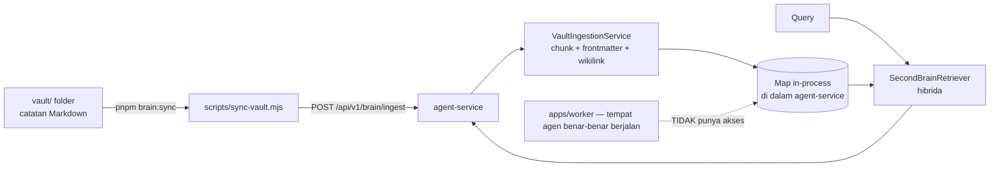

# 🧠 Second Brain & Grounded RAG

> ⚠️ **Koreksi penting terhadap versi sebelumnya.** Catatan ini dulunya menyatakan vault
> diindeks ke **pgvector** dengan pencarian cosine similarity yang persisten. Itu **tidak
> benar**. Verifikasi DB 16 Sep 2026: **0 kolom bertipe `vector`**, ekstensi terpasang hanya
> `plpgsql, uuid-ossp`, dan `memory_embeddings.embedding` bertipe `jsonb` dengan 0 baris.
> Mekanisme sebenarnya dijelaskan di §4.

Niat desainnya tetap: menjadikan vault Obsidian ini sebagai basis pengetahuan yang bisa
di-query agen. Yang belum tercapai adalah sisi **persistensi** dan **keterjangkauan antar
proses**.

---

## 1. Tujuan Desain

1. **Grounding** — jawaban agen berbasis catatan nyata, bukan halusinasi.
2. **Local-first** — seluruh isi vault tetap file Markdown biasa; aplikasi hanya membaca.
3. **Incremental** — cukup ubah satu catatan, lalu sinkronkan ulang, tanpa rebuild penuh.
4. **Traceable** — setiap potongan jawaban dapat ditelusuri kembali ke catatan asalnya.

---

## 2. Arsitektur Sebenarnya



Titik krusialnya ada di panah putus-putus: **agent-service dan worker adalah dua proses
terpisah**. Agent hidup di worker; indeks hidup di agent-service. Karena itu agent tidak
dapat melihat hasil sinkronisasi. Rinciannya di §6.

---

## 3. Pipeline Ingesti

### 3.1 Pemicu
`scripts/sync-vault.mjs` (skrip `pnpm brain:sync`) mengirim:

```
POST http://127.0.0.1:<PORT>/api/v1/brain/ingest
Authorization: Bearer <API_AUTH_TOKEN dari .env>
Body: { vaultPath, scope: "second_brain" }
```

Ingesti otomatis juga dijalankan saat agent-service boot
(`apps/agent-service/src/server.ts:348`).

### 3.2 Pemrosesan Potongan

| Tahap | Perilaku |
| :--- | :--- |
| Ekstraksi frontmatter | Properti `title`, `tags`, `scope`, `category` dibaca sebagai metadata |
| Deteksi wikilink | Pola `[[Catatan]]`, `[[Catatan#Heading]]`, `[[Catatan\|Alias]]` dipakai membentuk graf keterhubungan |
| Pemecahan bagian | Dokumen dipecah per level heading (`#`, `##`, `###`) |
| Chunking token | Tiap bagian dijaga di bawah batas token dengan overlap halus |

> Catatan teknis: pola `[[Target Note]]` yang ditulis **di dalam backtick** (inline code)
> atau di dalam blok kode ```mermaid``` **bukan** wikilink bagi Obsidian dan **tidak**
> masuk graf keterhubungan. Ini termasuk contoh sintaks, bukan tautan rusak.

### 3.3 Embedding
`VectorEmbeddingService` memilih sumber embedding secara berurutan:

1. **Ollama** lokal bila tersedia (`OLLAMA_BASE_URL`).
2. **Cloud embedding** bila kunci provider tersedia.
3. **Fallback deterministik** bila tidak ada keduanya
   (`packages/memory/src/second-brain/vector-embedding-service.ts:62-80`).

Pada urutan ketiga, kemiripan vektor tidak lagi bermakna semantik — ia hanya sinyal
stabil untuk pencocokan kasar.

---

## 4. Penyimpanan Sebenarnya: `Map` In-Process

**Sumber**: `packages/memory/src/second-brain/vault-ingestion-service.ts:25-26`.

```ts
// potongan dan dokumen disimpan di dalam proses, bukan di database
private readonly documents = new Map<...>();
private readonly chunks = new Map<...>();
```

Konsekuensi yang harus dipahami:

- **Tidak ada kolom `vector`** dan **tidak ada indeks HNSW/IVFFlat** di PostgreSQL.
- **Tidak ada tabel chunk.** Tidak ada yang bisa di-query dari SQL.
- Indeks **hilang setiap proses agent-service dimatikan**, dan harus disinkronkan ulang.
- `GET /api/v1/brain/stats` **selalu** mengembalikan `durable: true` secara hardcoded
  (`apps/agent-service/src/routes/second-brain.ts:44,64,77`). Nilai itu **tidak
  mencerminkan kenyataan** — jangan dipakai sebagai bukti persistensi.
- Migrasi `001_initial_schema.sql:6-12` membungkus `CREATE EXTENSION vector` dalam
  `DO $$ ... EXCEPTION WHEN OTHERS THEN NULL` sehingga kegagalannya tidak bersuara.
  Akibatnya tabel `memory_embeddings` tetap ada, tetapi kolom `embedding` bertipe `jsonb`
  dan **0 baris** — begitu pula `memory_items` (0 baris).

Artinya: **memory jangka panjang dan Second Brain belum menyimpan apa pun secara nyata
hari ini.** Mesin pengambilan memorinya (`memory.search`, `memory.get`,
`memory.propose_write`) sudah terpasang, tetapi belum ada data yang mengalir masuk.

---

## 5. Strategi Pengambilan (Retrieval)

`SecondBrainRetriever` memakai skor **hibrida**, bukan cosine similarity murni
(`packages/memory/src/second-brain/second-brain-retriever.ts:70`):

```
skor = 0.6 × kemiripan vektor
     + 0.3 × kemiripan leksikal
     + min(0.1, bonusJudul)
```

Penalaran di baliknya: pencarian leksikal menangkap istilah teknis persis (`AgentRunner`,
`event_outbox`) yang sering luput oleh embedding, sementara komponen vektor menangkap
parafrase. Bonus judul memberi sedikit keunggulan pada catatan yang judulnya cocok.

Endpoint yang tersedia:

| Endpoint | Fungsi |
| :--- | :--- |
| `POST /api/v1/brain/ingest` | Memuat ulang vault ke indeks |
| `GET /api/v1/brain/stats` | Statistik indeks (**ingat: `durable` hardcoded**) |
| `GET /api/v1/brain/notes` | Daftar catatan terindeks |
| `GET /api/v1/brain/notes/:id` | Isi satu catatan |
| `DELETE /api/v1/brain/notes/:id` | Hapus satu catatan dari indeks |
| `GET /api/v1/brain/search` | Pencarian potongan |
| `POST /api/v1/brain/query` | RAG: pencarian + jawaban model |

> Tidak ada endpoint `/api/v1/brain/rag`. Yang benar adalah `/api/v1/brain/query`.

---

## 6. Keterputusan Antar Proses (Cacat yang Harus Diketahui)

Ini penjelasan mengapa "vault sebagai otak kedua" belum benar-benar bekerja untuk agen:

1. **Indeks hanya hidup di agent-service.** `SecondBrainService` diinstansiasi di
   `apps/agent-service/src/server.ts:324-326` dan di test. Ia **tidak pernah** dibangun di
   `apps/worker/src/worker.ts`.
2. **Agent berjalan di worker.** Seluruh eksekusi model dan tool ada di worker
   ([[Task & Execution Pipeline]] §4).
3. **Tool Second Brain tidak terdaftar di worker.** `createSecondBrainTools` mengekspor
   `second_brain.search`, `second_brain.read_note`, `second_brain.list_notes`,
   `second_brain.query`, `second_brain.sync_vault`
   (`packages/tools/src/tools/second-brain-tools.ts:7,67,123,170,215`), tetapi
   `apps/worker/src/worker.ts:100-129` **tidak mendaftarkan satu pun** dari tool itu.
   Bila agen memanggilnya, hasilnya adalah
   `Tool '<x>' not found in Tool Gateway registry.`

**Kesimpulan jujur:** `pnpm brain:sync` hanya bermanfaat untuk halaman `/brain` di dashboard
(dashboard memanggil agent-service). Agent tidak dapat melakukan grounding ke vault ini
sampai tool-nya didaftarkan ke worker *dan* indeksnya dipindahkan ke penyimpanan bersama
(mis. tabel PostgreSQL) sehingga kedua proses melihat data yang sama.

---

## 7. Yang Sudah Berfungsi vs Belum

| Kapabilitas | Status |
| :--- | :--- |
| Ingesti vault & pemecahan chunk | ✅ berfungsi (in-process) |
| Pencarian hibrida via HTTP | ✅ berfungsi (in-process) |
| Halaman `/brain` dashboard | ✅ berfungsi |
| Persistensi lintas restart | ❌ hilang saat proses mati |
| Klaim `durable` di `/brain/stats` | ❌ nilai hardcoded, tidak benar |
| Indeks vektor di PostgreSQL | ❌ tidak ada |
| Grounding agen dari tool | ❌ tool tidak terdaftar di worker |
| Isi `memory_items` / `memory_embeddings` | ❌ keduanya 0 baris |

---

## 8. Tautan Terkait

- [[010 - System Architecture MOC]]
- [[Personal Knowledge & Memory Protocol]]
- [[Chief - System Orchestrator]]
- [[Implementation Status & Known Gaps]]

---

⬅️ Kembali ke [[000 - Home MOC]]
