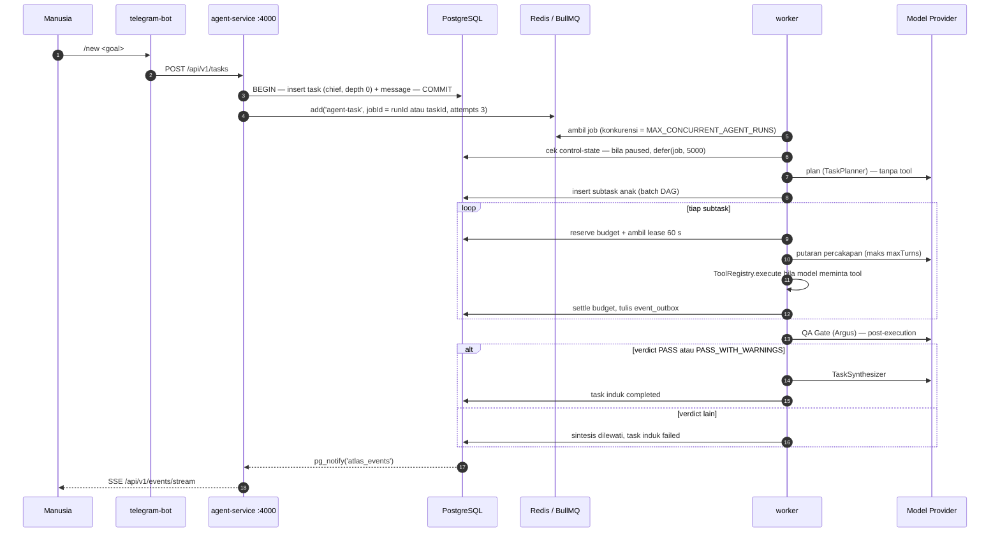
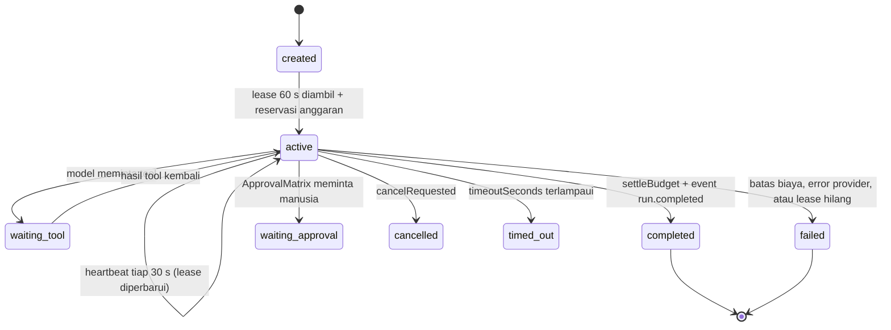

# ⚙️ Task & Execution Pipeline — Alur Lengkap

> Ini catatan alur kanonik. Setiap tahap di bawah diverifikasi langsung terhadap kode pada
> **16 Sep 2026** dan diberi anchor `path:line`. Bila ada catatan lain yang bertentangan
> dengan halaman ini, halaman ini yang berlaku.

---

## 1. Ikhtisar Satu Gambar



---

## 2. Tahap 1 — Intake

Dua pintu masuk, keduanya berakhir pada pembuatan task yang sama:

1. **Telegram** — `/new <goal>` (`apps/telegram-bot/src/handlers/commands.ts:159`).
2. **HTTP** — `POST /api/v1/tasks` (`apps/agent-service/src/routes/tasks.ts:32`).

```
task.assignedAgent = 'chief'
task.depth         = 0
```

- Task dan pesan intake (`messages`) ditulis dalam **satu transaksi**; bila transaksi gagal,
  job tidak pernah masuk BullMQ — mencegah task yatim.
- **Gerbang kontrol**: bila sistem sedang `paused` atau emergency-stop, permintaan ditolak
  dengan **HTTP 423** (`apps/agent-service/src/routes/tasks.ts:50-63`).

Status task mengikuti enum kanonik (`packages/shared/src/schemas/task.ts:3-13`, ditegakkan
CHECK constraint `packages/database/src/migrations/010_task_status_integrity.sql:17-27`):

```
queued | planning | running | review_pending | approval_pending | completed | failed | cancelled
```

> Tidak ada status `pending`, tidak ada `waiting_approval`, tidak ada `timed_out` pada task.
> Status `timed_out` hanya ada pada **run**.

---

## 3. Tahap 2 — Antrian

`packages/orchestration/src/queue/bullmq-task-queue.ts:18-31`:

| Properti | Nilai |
| :--- | :--- |
| Nama queue | `atlas-agent-tasks` |
| Nama job | `agent-task` |
| Job ID | `runId` atau `taskId` (menjaga idempotensi enqueue) |
| `attempts` | 3 |
| Backoff | eksponensial, basis 1000 ms |

agent-service hanya menulis job (`processQueue: false`,
`apps/agent-service/src/index.ts:31-33`). Eksekusi sepenuhnya milik worker.

---

## 4. Tahap 3 — Worker Mengambil Job

`apps/worker/src/worker.ts:263-266` — konkurensi `MAX_CONCURRENT_AGENT_RUNS` (default 3).

1. **Cek kontrol.** Bila `paused` → `defer(job, 5000)` (`:267-290`); job dikembalikan ke
   antrian, bukan digagalkan.
2. **Pilih jalur berdasarkan role** (`:294-304`):
   - `role === 'orchestrator'` (hanya Chief) → `TaskDelegator.executePlan`
   - peran lain → `AgentRunner.run({ runId, approvalToken })`
3. **Resume approval** memakai `job.approvalResume` (`runId` + `approvalToken`) yang
   dititipkan saat approval diputuskan.

---

## 5. Tahap 4 — Perencanaan

`TaskDelegator.executePlan` di `packages/orchestration/src/delegator/task-delegator.ts:111`:

```
TaskPlanner.plan  →  PlanValidator.assertValid  →  [fallback]  →  eksekusi batch DAG
```

> ⚠️ **Fallback diam-diam**: bila plan gagal validasi, `TaskPlanner` **tidak melempar error**
> melainkan memakai `generateFallbackPlan`
> (`packages/orchestration/src/planner/task-planner.ts:111-131`). Akibatnya rencana buruk
> tidak pernah menggagalkan task — ia hanya turun kualitas.

Rencana dijalankan sebagai **batch DAG paralel** selebar `maxConcurrency || 3`.

### 5.1 Batas Kedalaman

`DepthGuard.validateDelegation` dipanggil di `task-delegator.ts:174-179`
(`packages/policy/src/depth-guard.ts:12-40`; plafonnya `DepthGuard.DEFAULT_MAX_DEPTH = 2` di
`packages/policy/src/depth-guard.ts:10`, yang dipakai sebagai default bila konteks tidak
menyebut `maxAllowedDepth` di `:13`. Nilainya sendiri berasal dari konfigurasi
`MAX_DELEGATION_DEPTH` (`packages/shared/src/schemas/config.ts:65`, default 2).

> ⚠️ **Praktis tidak aktif.** `task-delegator.ts:203` menghitung `depth` untuk task anak,
> tetapi `taskRepo.create` tidak pernah mempersistensi kolom itu. Snapshot DB 16 Sep 2026:
> **seluruh 55 task punya `depth = 0`**, termasuk 42 task yang punya `parent_id`.

---

## 6. Tahap 5 — Eksekusi oleh AgentRunner

`packages/orchestration/src/engine/agent-runner.ts:128` — inti dari seluruh sistem.

| Mekanisme | Nilai nyata | Anchor |
| :--- | :--- | :--- |
| Lease | **60 detik** per **run** | `:148` |
| Heartbeat | `leaseSeconds/2`, dijepit 1000–30000 ms ⇒ **30 detik** | `:226` |
| Aksi saat heartbeat gagal | `controller.abort(...)` — run dibatalkan | `:228-236` |
| Timeout run | `limits.timeoutSeconds` per agent | `:142-147` |
| Putaran | `while (turnsCount < maxTurns)` | `:298` |
| Batas biaya keras | `totalCostUsd >= maxCostUsd` → `throw` | `:361-364` |
| Reservasi anggaran | sebelum loop | `:253-274` |
| Penyelesaian anggaran | `settleBudget` setelah selesai | — |

Urutan hidup satu run (status kanonik run:
`created | active | waiting_tool | waiting_child | waiting_approval | completed | failed | cancelled | timed_out`
— `packages/shared/src/schemas/run.ts:3-13`):



### 6.1 Pemanggilan Tool

Model meminta tool → `ToolGatewayExecutor` → `ToolRegistry.execute`
(`packages/tools/src/registry.ts:138-162`), dengan tiga gerbang berurutan (lihat
[[Policy, Security & Approval Gates]]).

### 6.2 Jalur Approval (menghentikan run, bukan memblokir worker)

Bila sebuah tool memerlukan persetujuan manusia:

1. `AgentRunner` **membatalkan run**, mengubah task menjadi `approval_pending`, dan
   **melepas lease** (`agent-runner.ts:534-547`) — worker tidak diblokir menunggu manusia.
2. Manusia memutuskan lewat `POST /api/v1/approvals/:id/decision` atau perintah Telegram
   `approve <id>` / `reject <id>`.
3. Saat disetujui, `approvalResume` dititipkan pada job baru sehingga eksekusi dapat
   dilanjutkan dengan `approvalToken`.

> ⚠️ **Tidak ada notifikasi push** ke manusia, dan **kedaluwarsa approval bersifat lazy** —
> tidak ada sweeper. Task bisa tertinggal di `approval_pending` selamanya.

---

## 7. Tahap 6 — Gerbang QA (Argus)

`packages/orchestration/src/qa/qa-gate.ts:26`.

| Aspek | Kenyataan |
| :--- | :--- |
| Posisi | **Setelah** eksekusi, **per subtask/plan**, bukan sebelum |
| Verdict | `PASS`, `PASS_WITH_WARNINGS`, `REVISION_REQUIRED`, `BLOCKED` (`:7`) |
| Lulus | Hanya `PASS` dan `PASS_WITH_WARNINGS` (`:109`) |
| Verdict tak dikenal | Otomatis menjadi `BLOCKED` (`:97-101`) |
| QA error | Menjadi `BLOCKED` (`task-delegator.ts:340-351`) |
| Bila tidak lulus | Sintesis **dilewati**, task induk di-set **`failed`** (`task-delegator.ts:354-361`) |
| Loop rework | **Tidak ada** — `REVISION_REQUIRED` adalah jalan buntu |

> ⚠️ Catatan akurasi: QA **bukan** pra-eksekusi dan **bukan** pemberi rekomendasi revisi yang
> otomatis dikembalikan ke pembuat draf. Verdict non-PASS mengakhiri jalur.

---

## 8. Tahap 7 — Sintesis

`TaskSynthesizer.synthesize` dipanggil hanya bila QA lulus. Hasil akhir ditulis ke task
induk dan dipublikasikan sebagai `task.completed`.

> Tahap planner, QA, dan synthesizer dibangun sebagai `stageRunner` **tanpa `toolExecutor`**
> (`task-delegator.ts:72-81`, berbeda dari `runner` utama di `:55-69` yang memang menerima
> `toolExecutor`). Artinya ketiga tahap ini tidak dapat memanggil tool sama
> sekali — termasuk Argus yang secara deklarasi punya `policy.verify`.

---

## 9. Jalur Kegagalan (terverifikasi dari DB)

Snapshot 16 Sep 2026: 106 run, 36 gagal.

| Penyebab | Jumlah |
| :--- | :--- |
| `OpenRouter HTTP 401 "User not found"` | 15 |
| `MODEL_API_KEY_MISSING` | 12 |
| `HTTP 429` (rate limit) | 3 |
| `Worker lease expired` | 2 |
| OpenRouter 402 / 429 / 502 | 1 masing-masing |
| `Invalid input for tool 'memory.search': expected array, received string` | 1 |
| Verdict QA sah (`SCOPE MISMATCH`, `CRITICAL SCOPE MISMATCH`, `Truncated content`) | sisanya |

**27 dari 36 kegagalan murni masalah kredensial** — bukan kegagalan logika orkestrasi.

Dampak turunan: 35 dari 106 run punya `turns_count = 0`, dan `turns_count` maksimum yang
pernah tercapai adalah **3**. Durasi run gagal terpanjang 1147 detik; run sukses rata-rata 21 detik.

---

## 10. Tahap 8 — Pemulihan

Saat boot dan secara berkala (`QUEUE_RECOVERY_INTERVAL_SECONDS`, default 30):

1. **`recoverStaleRuns()`** — `packages/database/src/repositories/run.repository.ts:207-227`.
   Run berstatus `created | active | waiting_tool | waiting_child` dengan
   `lease_expires_at < NOW()` ditandai **`failed`**, error `Worker lease expired`, dan
   `worker_id` / `heartbeat_at` / `lease_expires_at` di-NULL-kan.
   → **Tidak** mengembalikan task ke `queued` dan **tidak** mempertahankan konteks.
2. **`recoverQueuedTasks()`** — mem-paging task berstatus `queued` (batch 1000) dan
   melewati task yang masih punya `hasPending`.

BullMQ **tidak** dikonfigurasi `stalledInterval`, `maxStalledCount`, maupun `lockDuration`
— opsi `Worker` hanya berisi `connection` dan `concurrency`
(`packages/orchestration/src/queue/bullmq-task-queue.ts:70-74`). Pemulihan sepenuhnya
ditangani mekanisme di atas.

> Catatan diagnosa: `0/106` run punya `worker_id` **bukan** bukti jalur lease mati.
> `run.repository.ts:265-276` memang meng-NULL-kan kolom lease saat run mencapai status
> terminal. Bukti bahwa `recoverStaleRuns` pernah bekerja adalah 2 run dengan error
> `Worker lease expired`.

---

## 11. Tahap 9 — Publikasi Event ke UI

1. `EventBus.publish` menulis ke `event_outbox` (`ON CONFLICT event_id DO NOTHING`) dan
   memanggil `pg_notify('atlas_events', ...)` — `packages/events/src/bus.ts:63-82`.
2. agent-service `LISTEN atlas_events` — `EventBus.startListener` di
   `packages/events/src/bus.ts:102-107` (dipicu otomatis oleh `subscribe` di `:86`).
3. SSE ke klien di `apps/agent-service/src/routes/events.ts:32-81`, dengan format
   `id:` / `event:` / `data:`, komentar heartbeat `: ` tiap 15 detik, dan replay lewat
   header `Last-Event-ID` → `eventRepo.listAfterId`.

Nama event memakai **titik**, bukan titik dua: `run.started`, `run.turn_completed`,
`run.completed`, `run.failed`, `task.created`, `task.updated`, `task.completed`,
`task.failed`, `message.created`.

Detail lengkap ada di [[Observability & Audit Trail]].

---

## 12. Representasi Nyata di Database

| Tabel | Isi (16 Sep 2026) |
| :--- | :--- |
| `tasks` | 55 — 40 `completed`, 10 `failed`, **5 macet di `running`** |
| `runs` | 106 — 70 `completed`, 36 `failed` |
| `tool_calls` | **5** — `memory.search` ×3, `artifacts.write` ×1, `artifacts.read` ×1 |
| `approvals` | **0** |
| `event_outbox` | `run.started` 106, `run.turn_completed` 73, `run.completed` 70, `task.updated` 63, `task.created` 55, `task.completed` 40, `run.failed` 34, `message.created` 21, `task.failed` 10 |

Jendela data run: `2026-08-28T18:50Z` → `2026-09-03T20:23Z`.

Anomali yang perlu diperhatikan: **5 task berstatus `running` tetapi tidak ada run aktif**.
Ini konsisten dengan `recoverQueuedTasks()` yang hanya memulihkan status `queued` — task
`running` yatim tidak pernah dibersihkan.

---

## 13. Tautan Terkait

- [[010 - System Architecture MOC]]
- [[ATLAS AI OS Blueprint]]
- [[Chief - System Orchestrator]]
- [[Argus - QA & Risk Gate Specialist]]
- [[Policy, Security & Approval Gates]]
- [[Observability & Audit Trail]]
- [[Implementation Status & Known Gaps]]

---

⬅️ Kembali ke [[000 - Home MOC]]
