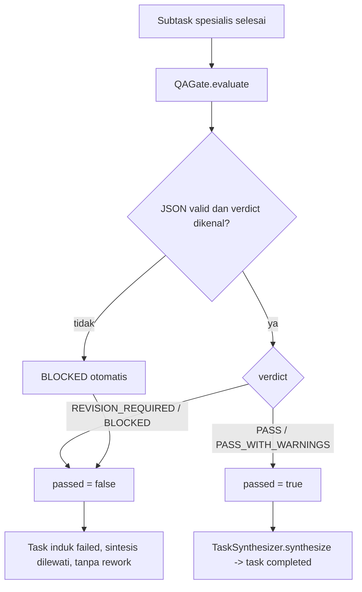

# 🛡️ Argus — QA & Risk Gate Specialist

Argus adalah gerbang kualitas armada. Ia **bukan pemeriksaan pra-eksekusi**: `QAGate.evaluate` dipanggil **setelah** seluruh subtask spesialis selesai, dan keputusannya bersifat **terminal** — tidak ada loop rework.

## 📋 Ikhtisar Agent

| Parameter | Nilai |
| :--- | :--- |
| **ID** | `argus` |
| **Role** | `qa_verifier` |
| **Sumber definisi** | `packages/agents/src/definitions/argus.ts` — didaftarkan di `packages/agents/src/registry.ts:12-19` |
| **Jalur utama** | `QAGate.evaluate` (`packages/orchestration/src/qa/qa-gate.ts:26`) yang dipanggil `TaskDelegator` (`packages/orchestration/src/delegator/task-delegator.ts:340-351`) |
| **Jejak Eksekusi** | **22 run** (snapshot DB 16 Sep 2026) |

## 🎯 Format Output Wajib (Required Structure)

1. **Verdict**: tepat satu dari `PASS`, `PASS_WITH_WARNINGS`, `REVISION_REQUIRED`, `BLOCKED`.
2. **Factuality Check** — apakah klaim dan statistik didukung sumber.
3. **Scope & Temporal Check** — apakah parameter pengguna (tanggal, jam, zona waktu WIB) dipertahankan dan tidak jadi `[TBD]`.
4. **Language Purity Check** — tidak ada token bahasa asing / *code-switching*.
5. **Calculation Check** — validasi matematis skor, bobot, durasi.
6. **Policy & Safety Check** — tidak ada aksi terlarang, penulisan tak sah, atau kebocoran metadata.
7. **Identified Issues** — daftar temuan, sitasi hilang, diskrepansi.
8. **Recommendations / Required Revisions**.

## 🛑 Aturan Ketat (Rules)

1. **No Silent Fixes** — Argus tidak memperbaiki draf sendiri; ia menerbitkan temuan dan verdict agar agent pembuat yang memperbaiki.
2. **Strict Failure Conditions** — Bila bukti klaim faktual hilang atau ada fragmen bahasa asing, verdict **tidak boleh** `PASS`.
3. **Fail-Closed** — Bila keselamatan, izin, atau klaim faktual inti dilanggar, Argus menutup gerbang.

## 📐 Verdict dan Konsekuensi Nyatanya

- Enum verdict: `PASS | PASS_WITH_WARNINGS | REVISION_REQUIRED | BLOCKED` (`packages/orchestration/src/qa/qa-gate.ts:7`).
- Hanya `PASS` dan `PASS_WITH_WARNINGS` dianggap lulus (`qa-gate.ts:109`).
- Verdict tak dikenal → otomatis `BLOCKED` (`qa-gate.ts:97-101`); respons bukan JSON valid → `BLOCKED` juga.
- Error saat QA dijalankan → `BLOCKED` (`task-delegator.ts:344-352`).
- Verdict non-lulus membuat **task induk `failed`** dan **sintesis dilewati** (`task-delegator.ts:353-371`). `REVISION_REQUIRED` berakhir sama seperti `BLOCKED` — **tidak ada loop rework**.
- Gate dipanggil delegator tanpa memeriksa `review.requiredAgent`; seluruh parent task yang lewat `executePlan` dievaluasi QA.

## 📏 Batas Eksekusi (dan Apa yang Sungguh-Sungguh Ditegakkan)

| Parameter | Nilai | Ditegakkan? | Anchor |
| :--- | :--- | :--- | :--- |
| `maxTurns` | **6** | ✅ Ya | `packages/orchestration/src/engine/agent-runner.ts:298` |
| `timeoutSeconds` | **120** s | ✅ Ya — satu-satunya agent dengan 120, bukan 180 | `packages/orchestration/src/engine/agent-runner.ts:142-147` |
| `maxCostUsd` | **0.35** USD | ✅ Ya | `packages/orchestration/src/engine/agent-runner.ts:361-364` |
| `maxDelegationDepth` | **1** | ⚠️ Guard ada, praktis no-op | `task-delegator.ts:174-179`; `packages/policy/src/depth-guard.ts:12-40` |
| `temperature` | 0.0 (deklarasi) | ❌ Tidak pernah dibaca kode eksekusi | lihat bagian koreksi |

> **Depth anak tidak dipersistensi.** `task-delegator.ts:203` menghitung `depth` namun `taskRepo.create` tidak menuliskannya ⇒ **semua 55 task di DB `depth = 0`** dan `DepthGuard` praktis no-op.

## 🛠️ Tools: Deklarasi, Registrasi, dan Kenyataan Jalur QA

| Tool | Dideklarasikan | Terdaftar di worker | Dapat dipakai Argus? |
| :--- | :--- | :--- | :--- |
| `policy.verify` | ✅ | ✅ | ❌ Tidak pada jalur QA gate |
| `memory.search` | ✅ | ✅ | ❌ Tidak pada jalur QA gate |
| `artifacts.read` | ✅ | ✅ | ❌ Tidak pada jalur QA gate |

Allowlist Argus (`packages/agents/src/definitions/argus.ts:35`) memang seluruhnya terdaftar di worker (`apps/worker/src/worker.ts:100-129`) — **tetapi jalur QA tidak memberinya eksekutor tool sama sekali**:

- `QAGate` dan planner dijalankan delegator lewat `stageRunner`, yaitu `AgentRunner` yang dibangun **tanpa `toolExecutor`** (`task-delegator.ts:72-81`).
- Akibatnya runner tidak pernah mengirim definisi tool ke model (`packages/orchestration/src/engine/agent-runner.ts:308`), sehingga tidak ada tool yang dapat dipanggil.
- Bila model tetap mengeluarkan tool call pada jalur tanpa executor, runner menetapkan hasil `{ success: true }` (`agent-runner.ts:374-389`) dan **tidak mengeksekusi apa pun** — jadi klaim "Argus memakai `policy.verify`" tidak dapat diverifikasi dari runtime.

## ⛔ Koreksi Penting: `modelPolicy` Tidak Dikonsumsi

- `temperature` (0.0) dan `fallbackTier` (`fast`) **tidak pernah dibaca kode eksekusi**; `AgentRunner` tidak meneruskan `temperature`/`maxTokens` ke provider sehingga Argus efektif memakai default provider **0.2** — bukan 0.0.
- `modelPolicy` dipersistensikan ke kolom `model_policy` (`packages/database/src/agent-seeder.ts:7`) tetapi tidak dikonsumsi kode mana pun.
- Tidak ada rantai fallback antar model/provider.

## 🧪 Verifikasi Runtime

### Status Runtime (16 Sep 2026)

- **Jejak eksekusi**: `argus` **22 run** — terbanyak kedua setelah chief (distribusi: chief 54, argus 22, ned 15, hermes 13, layla 2, luna 0).
- **Gerbangnya nyata dan bekerja**: kegagalan run yang tercatat memuat verdict QA sah seperti `SCOPE MISMATCH`, `CRITICAL SCOPE MISMATCH`, dan `Truncated content`.
- **`policy.verify` tidak pernah dipanggil**: DB mencatat **0 pemanggilan `policy.*`**; total `tool_calls` sistem hanya 5 (`memory.search` 2 sukses + 1 gagal, `artifacts.write` 1, `artifacts.read` 1). Ini konsisten dengan jalur QA yang dibangun tanpa `toolExecutor`.
- **Tidak ada approval yang pernah mengalir** sebagai konsekuensi QA: tabel `approvals` 0 baris, `event_outbox` 0 event `approval.*`, dan 0 event `tool.*`.
- Kegagalan run armada: 36 gagal, **27 di antaranya kegagalan kredensial** (`OpenRouter HTTP 401 "User not found"` ×15, `MODEL_API_KEY_MISSING` ×12). Karena QA memanggil provider juga, kegagalan kredensial ini ikut memblokir task — masuk akal mengingat error QA otomatis menjadi `BLOCKED` (`task-delegator.ts:344-352`).
- Biaya armada total `$0.0130`; sejak 3 Sep 2026 tiap run `$0.0000` karena tarif provider dinolkan (`packages/providers/src/openrouter.ts:18-19`) ⇒ plafon `maxCostUsd` 0.35 Argus tidak pernah menyala. Jendela data run berakhir `2026-09-03T20:23Z` — platform idle.
- Lima dari 55 task macet di status `running` — sisa lease mati: `recoverStaleRuns` menandai **run** `failed` dengan error `Worker lease expired` tanpa mengembalikan task ke `queued` (`packages/database/src/repositories/run.repository.ts:207-227`). Lihat [[Disaster Recovery & Lease Watchdog]].

## 🔗 Tautan Terkait

- [[020 - Agent Fleet MOC]]
- [[Chief - System Orchestrator]]
- [[Ned - Research Specialist]]
- [[Luna - Data & Market Analyst Specialist]]
- [[Layla - Lead Scoring Specialist]]
- [[Hermes - Content Specialist]]
- [[Policy, Security & Approval Gates]]
- [[Task & Execution Pipeline]]

⬅️ Kembali ke [[000 - Home MOC]]
