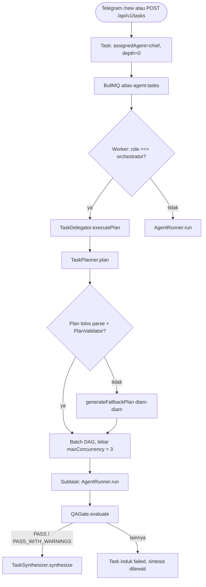

# 👑 Chief — System Orchestrator

Chief adalah **satu-satunya pintu masuk** armada: setiap task dari Telegram atau HTTP ditulis dengan `assignedAgent: 'chief'` dan `depth: 0`, dan worker memilih **jalur delegasi** (bukan eksekusi langsung) karena `role === 'orchestrator'` (`apps/worker/src/worker.ts:294-304`).

## 📋 Ikhtisar Agent

| Parameter | Nilai |
| :--- | :--- |
| **ID** | `chief` |
| **Role** | `orchestrator` |
| **Sumber definisi** | `packages/agents/src/definitions/chief.ts` — didaftarkan di `packages/agents/src/registry.ts:12-19` |
| **Jalur eksekusi** | `TaskDelegator.executePlan` (`apps/worker/src/worker.ts:294-304`) |
| **Tanggung Jawab Utama** | Dekomposisi goal, penyusunan plan terstruktur, delegasi subtask ke spesialis, pengawasan QA, sintesis akhir untuk pengguna |

## 🎯 Aturan Operasional (Persona Nyata di Kode)

Enam aturan berikut berasal dari `systemPrompt` Chief dan tetap berlaku sebagai niat desain:

1. **Scope Fidelity** — Berpegang ketat pada parameter eksplisit pengguna (tanggal, jam, zona waktu WIB/WITA/WIT, peserta, sasaran). Dilarang memperbesar permintaan ringkas menjadi rencana korporat yang tidak diminta.
2. **Language Purity** — Seluruh komunikasi dan sintesis akhir dalam bahasa target (Indonesia/Inggris); dilarang menyisipkan fragmen bahasa asing.
3. **Factual Integrity** — Semua konten bersandar pada data terverifikasi atau input pengguna. Dilarang mengarang statistik/persentase/sumber survei palsu kecuali benar-benar diambil oleh [[Ned - Research Specialist|Ned]].
4. **Deliverable Cleanliness** — Deliverable untuk pengguna bersih dari metadata agent internal, catatan debug, dan skor keyakinan.
5. **Delegation Discipline** — Kedalaman delegasi maksimum 2; dilarang mendelegasikan ke diri sendiri; draf akhir lewat satu kali verifikasi QA oleh [[Argus - QA & Risk Gate Specialist|Argus]].
6. **Safety & Permissions** — *Fail closed* bila izin tool atau kebijakan keamanan ambigu.

## 🔀 Rute Eksekusi yang Benar-Benar Terjadi

- **Intake**: Telegram `/new <goal>` (`apps/telegram-bot/src/handlers/commands.ts:159`) atau `POST /api/v1/tasks` (`apps/agent-service/src/routes/tasks.ts:32`). Task dan pesan intake ditulis dalam satu transaksi; gagal transaksi berarti job tidak pernah masuk BullMQ.
- **Antrian**: queue `atlas-agent-tasks`, job `agent-task`, `jobId = runId || taskId`, `attempts: 3` (`packages/orchestration/src/queue/bullmq-task-queue.ts:18-31`). agent-service **tidak** memproses queue (`apps/agent-service/src/index.ts:31-33`, `processQueue: false`).
- **Worker**: `process(MAX_CONCURRENT_AGENT_RUNS || 3)` (`apps/worker/src/worker.ts:266`); cek control-state lebih dulu dan `defer(job, 5000)` bila sistem dijeda (`:268-287`).
- **Delegasi**: `TaskDelegator.executePlan` (`packages/orchestration/src/delegator/task-delegator.ts:111`) → `TaskPlanner.plan` → `PlanValidator.assertValid` → **fallback diam-diam** `generateFallbackPlan` bila plan gagal diparse/divalidasi (`packages/orchestration/src/planner/task-planner.ts:111-131`). Artinya plan buruk tidak pernah menggagalkan task.
- **Subtask anak dibuat oleh delegator secara internal**, bukan oleh tool `tasks.create_child`. Tool itu memang dideklarasikan di definisi Chief, tetapi **tidak pernah terdaftar** di worker, jadi pemanggilannya akan gagal `Tool 'tasks.create_child' not found in Tool Gateway registry.`
- **Urutan per subtask**: `AgentRunner.run` → `QAGate.evaluate` (setelah eksekusi) → `TaskSynthesizer.synthesize`.

## 📏 Batas Eksekusi (dan Apa yang Sungguh-Sungguh Ditegakkan)

| Parameter | Nilai | Ditegakkan? | Anchor |
| :--- | :--- | :--- | :--- |
| `maxTurns` | **15** | ✅ Ya — loop `while (turnsCount < maxTurns)` | `packages/orchestration/src/engine/agent-runner.ts:298` |
| `timeoutSeconds` | **180** s | ✅ Ya — timer watchdog per run | `packages/orchestration/src/engine/agent-runner.ts:142-147` |
| `maxCostUsd` | **1.0** USD | ✅ Ya — plafon keras, `throw` bila tercapai | `packages/orchestration/src/engine/agent-runner.ts:361-364` |
| `maxDelegationDepth` | **2** | ⚠️ Ada guard, praktis no-op — lihat di bawah | `task-delegator.ts:174-179`; `packages/policy/src/depth-guard.ts:12-40` |
| `temperature` | 0.2 (deklarasi) | ❌ **Tidak pernah dibaca kode eksekusi** | lihat bagian koreksi |

**Delegasi praktis tidak dibatasi.** `DepthGuard.validateDelegation` dipanggil dengan `currentDepth: parentTask.depth` (`task-delegator.ts:174-179`), tetapi `task-delegator.ts:203` menghitung `depth: parentTask.depth + 1` pada objek anak yang **tidak pernah dipersistensi** oleh `taskRepo.create`. Akibatnya **semua 55 task di DB punya `depth = 0`** (16 Sep 2026) dan `DepthGuard` tidak pernah menolak apa pun.

## 🛠️ Tools: Deklarasi vs Registrasi Nyata

Deklarasi allowlist Chief (`packages/agents/src/definitions/chief.ts:27-42`) berbeda dari yang benar-benar terdaftar di worker (`apps/worker/src/worker.ts:100-129`):

| Tool | Dideklarasikan | Terdaftar di worker | Catatan |
| :--- | :--- | :--- | :--- |
| `memory.search`, `memory.get` | ✅ | ✅ | Benar-benar tersedia |
| `artifacts.read`, `artifacts.write` | ✅ | ✅ | Benar-benar tersedia |
| `second_brain.search` | ✅ | ❌ | Gagal `Tool 'second_brain.search' not found in Tool Gateway registry.` |
| `second_brain.read_note` | ✅ | ❌ | idem |
| `second_brain.list_notes` | ✅ | ❌ | idem |
| `second_brain.query` | ✅ | ❌ | idem |
| `second_brain.sync_vault` | ✅ | ❌ | idem |
| `tasks.create_child` | ✅ | ❌ | Anak task dibuat internal oleh delegator |
| `tasks.update_status`, `tasks.get`, `tasks.list` | ✅ | ❌ | idem |
| `approvals.request` | ✅ | ❌ | Approval nyata lewat `ApprovalMatrix`, bukan tool ini |

Tool yang benar-benar terdaftar di worker: `web.search`, `web.fetch_safe`, `company.lookup`, `lead.enrich`, `lead.score`, `policy.verify`, `communication.create_draft`, `communication.send_approved`, `memory.search`/`memory.get`/`memory.propose_write`, `artifacts.read`/`artifacts.write` (`apps/worker/src/worker.ts:100-129`).

## ⛔ Koreksi Penting: `modelPolicy` Tidak Dikonsumsi

- `temperature` (0.2) dan `fallbackTier` (`fast`) **tidak pernah dibaca kode eksekusi**. `AgentRunner` tidak meneruskan `temperature` maupun `maxTokens` ke provider, sehingga semua agent efektif memakai default provider **0.2**.
- `modelPolicy` tetap dipersistensikan ke kolom `model_policy` tabel `agents` (`packages/database/src/agent-seeder.ts:7`), tetapi nilai itu hanya tersimpan — tidak ada konsumer di jalur eksekusi.
- `fallbackTier` tidak dibaca kode mana pun; **tidak ada rantai fallback antar model/provider**.

Detail mesin yang ditegakkan ada di [[Task & Execution Pipeline]].

## 🧪 Verifikasi Runtime

### Status Runtime (16 Sep 2026)

- **Jejak eksekusi**: `chief` **54 run** — jumlah terbanyak di armada (snapshot DB: 55 `tasks`, 106 `runs`, 6 `agents`, 266 `messages`).
- Worker tidak pernah memanggil `AgentRunner.run` untuk Chief; cabang `role === 'orchestrator'` langsung masuk `executePlan` (`apps/worker/src/worker.ts:294-304`). Run `chief` yang tercatat berasal dari tahap perencanaan internal delegator, yang memakai `stageRunner` — sebuah `AgentRunner` yang dibangun **tanpa `toolExecutor`** (`task-delegator.ts:72-81`). `[INFERENCE]` Karena prompt planner membatasi agent step ke spesialis, run `chief` di DB adalah run perencanaan.
- **Tidak ada tool yang bisa dieksekusi** pada run ber-`stageRunner`, karena `ToolGatewayExecutor` tidak ada.
- **QA bersifat post-execution dan terminal**: verdict selain `PASS`/`PASS_WITH_WARNINGS` membuat task induk `failed` dan sintesis dilewati (`task-delegator.ts:353-371`). Tidak ada loop rework; `REVISION_REQUIRED` berujung sama seperti `BLOCKED`.
- Kegagalan run tingkat armada: 36 run gagal, **27 di antaranya kegagalan kredensial** (`OpenRouter HTTP 401 "User not found"` ×15, `MODEL_API_KEY_MISSING` ×12).
- Biaya: total armada `$0.0130`; tarif provider dinolkan (`packages/providers/src/openrouter.ts:18-19`) sehingga sejak 3 Sep 2026 tiap run berbiaya `$0.0000` — plafon `maxCostUsd` Chief tidak pernah menyala.
- Jendela data run berakhir `2026-09-03T20:23Z`; platform idle sejak itu.

## 🔗 Tautan Terkait

- [[020 - Agent Fleet MOC]]
- [[Task & Execution Pipeline]]
- [[Policy, Security & Approval Gates]]
- [[Second Brain & Grounded RAG]]
- [[Ned - Research Specialist]]
- [[Luna - Data & Market Analyst Specialist]]
- [[Layla - Lead Scoring Specialist]]
- [[Hermes - Content Specialist]]
- [[Argus - QA & Risk Gate Specialist]]

⬅️ Kembali ke [[000 - Home MOC]]
