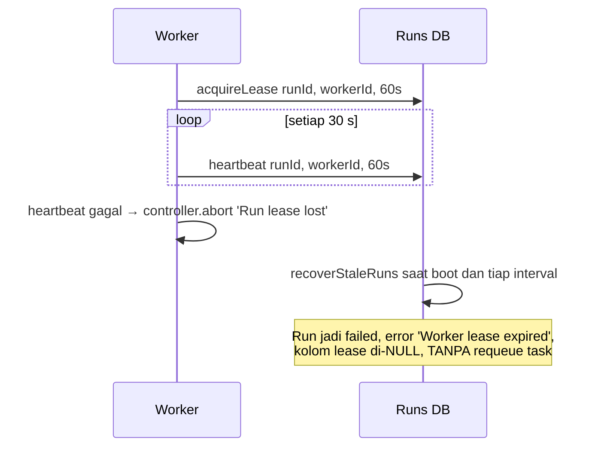

# 🛡️ Disaster Recovery & Lease Watchdog

Pemulihan ATLAS AI OS dari worker yang mati, run yang macet, serta backup/restore PostgreSQL. Angka dan semantik di catatan ini adalah keadaan nyata kode (snapshot 16 Sep 2026) — beberapa janji lama ("task dikembalikan ke `queued`", "lease 30 detik", "lease per task") **salah** dan sudah dikoreksi di bawah.

---

## 🐕 Lease & Heartbeat

- **Lease dimiliki oleh `run`, bukan `task`.** Kolom lease (`worker_id`, `heartbeat_at`, `lease_expires_at`) berada di tabel `runs` (dibuat migrasi `007_run_leases.sql`).
- **Durasi lease: 60 detik** — `const leaseSeconds = this.options.leaseSeconds || 60` (`packages/orchestration/src/engine/agent-runner.ts:148`).
- **Heartbeat: 30 detik.** Intervalnya dihitung `leaseSeconds/2` dijepit ke rentang 1000–30000 ms (`packages/orchestration/src/engine/agent-runner.ts:226`); untuk lease 60 s hasilnya 30.000 ms.
- **Heartbeat gagal ⇒ run dibatalkan:** `controller.abort('Run lease lost')` bila renewal mengembalikan `false` (`packages/orchestration/src/engine/agent-runner.ts:228-236`).
- **Lease tidak tersedia ⇒ run tidak dijalankan:** bila `acquireLease` gagal karena run sudah dimiliki worker lain, runner melempar `RUN_LEASE_UNAVAILABLE: run <id> is owned by another worker.` (`packages/orchestration/src/engine/agent-runner.ts:221-224`).
- Timeout run terpisah dari lease: `timeoutSeconds` per agent benar-benar dipakai (`packages/orchestration/src/engine/agent-runner.ts:142-147`).

---

## 🔍 Deteksi dan Pemulihan

### 1. `recoverStaleRuns` — menandai run mati, **tidak** mengantre ulang



`recoverStaleRuns(reason = 'Worker lease expired')` (`packages/database/src/repositories/run.repository.ts:207-227`) meng-update `runs` dengan kriteria:

- `status IN ('created', 'active', 'waiting_tool', 'waiting_child')`, dan
- `lease_expires_at IS NOT NULL AND lease_expires_at < NOW()`.

Efeknya (`packages/database/src/repositories/run.repository.ts:207-227`):

| Dilakukan | Tidak dilakukan |
|---|---|
| `status = 'failed'` | Mengembalikan task ke `queued` |
| `error = 'Worker lease expired'` | Menyimpan/memulihkan konteks run (turn, tool call, pesan) |
| `ended_at = NOW()` (bila kosong) | Melanjutkan run dari titik terakhir |
| `worker_id`, `heartbeat_at`, `lease_expires_at` di-`NULL`-kan | Membuat run pengganti |

**Jadi lease mati = run mati.** Task induknya tidak diantre ulang oleh mekanisme ini; hanya run yang gagal yang tercatat.

### 2. `recoverQueuedTasks` — jalur antre ulang yang benar-benar ada

Ini mekanisme terpisah, khusus untuk task yang **sudah** berstatus `queued` tetapi job-nya tidak ada di BullMQ:

- Dipanggil saat boot setelah `recoverStaleRuns` (`apps/worker/src/worker.ts:192-199`), dan berkala lewat `recoverQueuedTasksInBackground` tiap `QUEUE_RECOVERY_INTERVAL_SECONDS` — **default 30 detik** (`apps/worker/src/worker.ts:312-314`, `:455-462`).
- Mem-paging task berstatus `queued` dengan ukuran batch **1000** (`apps/worker/src/worker.ts:414-421`).
- **Melewati** task yang masih punya job pending di queue (`taskQueue.hasPending`) agar tidak ada eksekusi ganda (`apps/worker/src/worker.ts:434-436`).
- Task dengan `assigned_agent` yang tidak dikenal hanya dicatat sebagai error, tidak diantre (`apps/worker/src/worker.ts:425-432`).
- Task yang lolos dipanggil `taskQueue.enqueue({ task, agent, prompt: task.goal })` (`apps/worker/src/worker.ts:438-443`).

### 3. Jalur recovery lain saat boot

| Jalur | Lokasi | Fungsi |
|---|---|---|
| `runRepo.recoverStaleRuns()` | `apps/worker/src/worker.ts:192-199` | Run dengan lease kedaluwarsa → `failed` |
| `recoverQueuedTasks()` | `apps/worker/src/worker.ts:199`, `:414` | Antre ulang task `queued` yang belum punya job |
| `budgetRepo.recoverStaleReservations()` | `packages/runtime/src/index.ts:121` | Merapikan reservasi anggaran yang menggantung |

### 4. BullMQ **tidak** dikonfigurasi untuk stall

Worker BullMQ dibuat hanya dengan `connection: { url, maxRetriesPerRequest: null }` dan `concurrency` (`packages/orchestration/src/queue/bullmq-task-queue.ts:70-74`). Tidak ada `stalledInterval`, `maxStalledCount`, atau `lockDuration` — jadi BullMQ memakai nilai default-nya, dan deteksi stall praktis bergantung pada lease aplikasi + `recoverQueuedTasks`, bukan pada watchdog BullMQ.

---

## 🧾 Bukti Nyata dari Database

| Fakta | Angka | Arti |
|---|---|---|
| Run gagal ber-error `Worker lease expired` | **2** dari 36 run gagal | Jalur `recoverStaleRuns` pernah benar-benar dijalankan |
| Run yang punya `worker_id` | **0/106** | **NORMAL dan bukan bukti lease mati** |
| Task macet berstatus `running` | **5** dari 55 task | Karena tidak ada jalur requeue untuk task yang menunggu run mati, task seperti ini menggantung tanpa penutup `[INFERENCE]` |
| Jendela data run | `2026-08-28T18:50Z` → `2026-09-03T20:23Z` | Platform idle sejak 3 Sep; tidak ada run baru untuk diuji |
| Durasi run gagal | rata-rata 39 s, maksimum **1147 s** | Run panjang yang berakhir gagal pernah terjadi (timeout/lease) |

Kenapa `0/106 worker_id` itu normal: `packages/database/src/repositories/run.repository.ts:265-276` memang meng-`NULL`-kan `worker_id`, `heartbeat_at`, dan `lease_expires_at` saat run mencapai status terminal. Kolom lease hanya terisi selama run aktif, sehingga query "berapa run punya worker_id" selalu 0 pada sistem yang tidak sedang bekerja.

---

## 💾 Prosedur Backup Database

```bash
# Backup terkompresi (jalankan dari host yang bisa menjangkau Postgres)
pg_dump -U atlas -h localhost -d atlas | gzip > backup_atlas_$(date +%Y%m%d_%H%M%S).sql.gz
```

Untuk container produksi, ganti kredensial sesuai env (`POSTGRES_USER` default `atlas_admin`, `POSTGRES_DB` default `atlas_os`) dan jalankan lewat `docker compose -f docker-compose.prod.yml exec postgres ...`. Yang perlu dipastikan ikut tercadangkan: `tasks`, `runs`, `messages`, `event_outbox`, `audit_events`, `budgets`/`budget_reservations`, `approvals`, dan `model_provider_settings` (kunci API terenkripsi — backup tanpa `ENCRYPTION_KEY` yang sama tidak bisa didekripsi).

Catatan: hasil `brain:sync` **tidak** ikut tercadangkan karena indeksnya hanya ada di memori proses agent-service ([[Local Development Setup]]).

---

## 🔄 Prosedur Restore Database

```bash
# 1. Restore schema + data ke database target
gunzip -c backup_atlas_20260904_020000.sql.gz | psql -U atlas -h localhost -d atlas

# 2. Verifikasi dependensi lokal
pnpm dev:check

# 3. Nyalakan ulang stack (runtime akan menjalankan migrasi + seeding saat boot)
pnpm dev
```

⚠️ **Langkah 3 tidak akan berhasil pada host bersih.** Migrasi otomatis berhenti di `012_scheduled_jobs.sql` (`column "enabled" does not exist`), sehingga service menolak boot. Kalau restore dilakukan ke database baru, perbaiki dulu urutan/shape `scheduled_jobs` — detail lengkapnya di [[Database Migrations & pgvector Setup]]. Restore ke database yang sudah pernah diperbaiki manual (seperti DB saat ini) tidak terkena masalah ini karena `012` sudah tercatat di `schema_migrations`.

Setelah boot, urutan recovery otomatis berjalan sendiri: `recoverStaleRuns` → `recoverQueuedTasks` → pengulangan tiap 30 detik.

---

## ⚠️ Batas Sistem yang Perlu Diketahui Operator

- **Tidak ada requeue otomatis dari lease mati.** Run di-`failed`; task yang menunggunya bisa berhenti di `running` selamanya (5 task seperti itu ada di DB saat ini).
- **Tidak ada resume konteks.** Turn/tool call yang sudah terjadi tidak disimpan sebagai checkpoint pada jalur lease (tabel `workflow_checkpoints` memang ada, tetapi 0 baris).
- **Tidak ada dead-letter queue** maupun alarm terpusat; bukti kegagalan hanya terlihat dari `runs.error` dan `event_outbox`.
- **Approval kedaluwarsa bersifat lazy** — tidak ada sweeper, jadi task bisa tertinggal `approval_pending` tanpa batas (lihat [[Policy, Security & Approval Gates]]).
- **BullMQ memakai default stall handling** karena tidak ada `stalledInterval`/`maxStalledCount`/`lockDuration` yang diset.

---

## 🚦 Status Runtime (16 Sep 2026)

- ✅ Lease 60 detik + heartbeat 30 detik + abort `Run lease lost` benar-benar aktif di `AgentRunner`.
- ✅ `recoverStaleRuns` terbukti bekerja (2 run `Worker lease expired`), dan `recoverQueuedTasks` berjalan tiap 30 detik saat worker hidup.
- ✅ Backup/restore `pg_dump`/`psql` tetap prosedur yang sah.
- ❌ Tidak ada pemulihan task dari run yang lease-nya mati: 5 task tersangkut `running`.
- ⚠️ Tidak ada run baru sejak `2026-09-03T20:23Z`, jadi perilaku watchdog belum pernah diuji pada beban berjalan.

---

## 🔗 Tautan Terkait

- [[030 - Operations & Runbooks MOC]]
- [[Task & Execution Pipeline]]
- [[Database Migrations & pgvector Setup]]
- [[Production Deployment & Docker]]
- [[Local Development Setup]]

⬅️ Kembali ke [[000 - Home MOC]]
