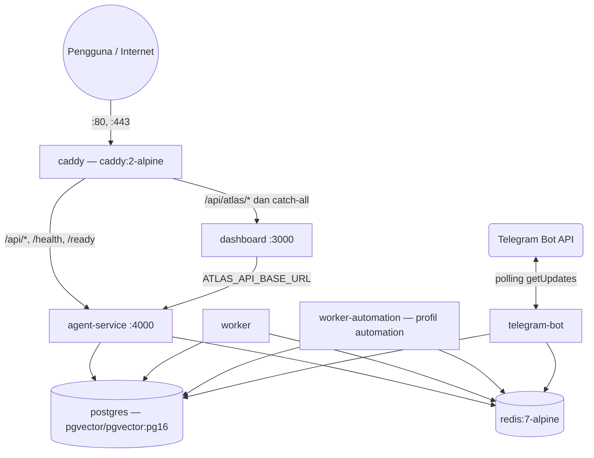

# 🚢 Production Deployment & Docker

Deployment produksi **ATLAS AI OS** memakai satu berkas Compose (`docker-compose.prod.yml`) berisi **8 layanan** — tujuh aplikasi plus Caddy sebagai reverse proxy di depan dashboard dan API. Catatan ini mengikuti isi berkas tersebut apa adanya (snapshot 16 Sep 2026) — termasuk hal-hal yang **tidak** ada di dalamnya.

---

## 🏗️ Topologi Container Produksi



Dependensi boot memakai `depends_on ... condition: service_healthy`: `agent-service`, `worker`, `worker-automation`, dan `telegram-bot` menunggu `postgres` + `redis` sehat; `dashboard` menunggu `agent-service`; `caddy` menunggu `dashboard` + `agent-service`.

### Daftar 8 layanan

| Layanan | Image / build | Port | Healthcheck | Batas resource |
|---|---|---|---|---|
| `postgres` | `pgvector/pgvector:pg16` | 5432 (internal) | `pg_isready -U ${POSTGRES_USER:-atlas_admin} -d ${POSTGRES_DB:-atlas_os}` | 1.5 CPU / 2G |
| `redis` | `redis:7-alpine` | 6379 (internal) | `redis-cli -a $REDIS_PASSWORD ping` | 0.5 CPU / 512M |
| `agent-service` | `apps/agent-service/Dockerfile` | **4000** | `node -e fetch('http://127.0.0.1:4000/ready')` | 1.0 CPU / 1G |
| `worker` | `apps/worker/Dockerfile` | health **8081** | `node -e fetch('http://127.0.0.1:8081/ready')` | 1.5 CPU / 2G |
| `worker-automation` | `apps/worker/Dockerfile` (image sama) | health **8081** | `node -e fetch('http://127.0.0.1:8081/ready')` | 1.5 CPU / 2G |
| `telegram-bot` | `apps/telegram-bot/Dockerfile` | health **8082** | `node -e fetch('http://127.0.0.1:8082/ready')` | 0.5 CPU / 512M |
| `dashboard` | `apps/dashboard/Dockerfile` | **3000** | `node -e fetch('http://127.0.0.1:3000/')` | 1.0 CPU / 1G |
| `caddy` | `caddy:2-alpine` | **80**, **443** (host) | `wget --spider` ke `http://127.0.0.1/health` dengan header `Host: ${ATLAS_DOMAIN:-localhost}` | 0.5 CPU / 256M |

Detail operasional — **tidak seragam di semua layanan**, jadi jangan digeneralisasi:

- `restart: always` → **benar untuk kedelapan layanan** (`docker-compose.prod.yml:5,31,56,110,177,242,290,326`).
- Logging `json-file` `max-size: 10m` / `max-file: 5` → dipakai **ketujuh** layanan aplikasi/database (postgres `:22-26`, redis `:45-49`, agent-service `:99-103`, worker `:163-167`, worker-automation `:230-234`, telegram-bot `:279-283`, dashboard `:317-321`). **`caddy` tidak punya blok `logging` sama sekali** (`:323-353`).
- Healthcheck `node -e fetch(...)` dengan `interval 15s / timeout 5s / retries 5 / start_period 20s` → hanya untuk **lima** layanan Node: agent-service `:77-88`, worker `:141-152`, worker-automation `:208-219`, telegram-bot `:257-268`, dashboard `:297-308`.
- **Pengecualian**: `postgres` memakai `pg_isready` (`:13-16`) dan `redis` memakai `redis-cli -a … ping` (`:36-39`) — keduanya `interval: 10s`, `timeout: 5s`, `retries: 5`, dan **tanpa `start_period`**. `caddy` memakai `wget --spider` (`:337-342`) tetapi tetap `15s/5s/5/20s`.

**`worker-automation` bersifat opt-in.** Layanan ini didefinisikan dengan `profiles: ['automation']`, jadi ia **tidak** ikut `up` biasa. Ia memakai image worker yang sama, menjalankan alur yang sama (TaskRepo → Queue → Delegator → Specialists → QA), dan dapat diskalakan terpisah dari `worker` untuk beban cron/workflow bervolume tinggi.

---

## 🔒 Caddyfile (isi nyata)

```caddyfile
{
    admin off
}

{$ATLAS_DOMAIN} {
    handle /api/atlas/* {
        reverse_proxy dashboard:3000
    }
    handle /api/* {
        reverse_proxy agent-service:4000
    }
    handle /health  { reverse_proxy agent-service:4000 }
    handle /ready   { reverse_proxy agent-service:4000 }
    handle          { reverse_proxy dashboard:3000 }
}
```

Poin penting:

- `admin off` — API admin Caddy dimatikan.
- Rute `/api/atlas/*` sengaja didahulukan (matcher lebih spesifik) dan diarahkan ke **Next.js** (`dashboard:3000`), bukan langsung ke Fastify: proxy server-side inilah yang menyuntikkan Bearer token sehingga token API tetap berada di sisi server (`apps/dashboard/src/app/api/atlas/[...path]/route.ts:15-17`).
- `/api/*` selebihnya, plus `/health` dan `/ready`, diarahkan ke `agent-service:4000`.
- Semua sisanya jatuh ke `dashboard:3000`.
- Host berasal dari variabel `{$ATLAS_DOMAIN}`.
- TLS: tidak ada blok `tls`/`auto_https` eksplisit di Caddyfile; port 80/443 diekspos dan terminasi HTTPS mengandalkan perilaku bawaan Caddy untuk hostname publik. `[INFERENCE]`

> **Koreksi klaim lama:** catatan sebelumnya menyebut Caddy "menambahkan security headers (`X-Content-Type-Options`, `X-Frame-Options`)" dan "meneruskan SSE dengan buffer dimatikan". **Tidak ada satu pun dari itu di `Caddyfile`.** Proxy Web/SSE polos milik Caddy memang meneruskan streaming, tetapi tidak ada konfigurasi buffering eksplisit di repo ini — jadi jangan mengklaim jaminan SSE dari sisi proxy.

---

## 🔐 Environment Wajib di Produksi

Compose memakai ekspansi `:?`, sehingga container **gagal start** bila variabel berikut kosong:

| Variabel | Dipakai oleh | Keterangan |
|---|---|---|
| `POSTGRES_PASSWORD` | postgres, agent-service, worker, worker-automation, telegram-bot | WAJIB |
| `REDIS_PASSWORD` | redis, agent-service, worker, worker-automation, telegram-bot | WAJIB (`redis-server --requirepass`) |
| `API_AUTH_TOKEN` | agent-service, worker, worker-automation, telegram-bot, dashboard | WAJIB; di native juga wajib saat `NODE_ENV=production` (`packages/shared/src/schemas/config.ts:68-90`) |
| `ENCRYPTION_KEY` | agent-service, worker, worker-automation, telegram-bot | WAJIB; tidak boleh sama dengan kunci contoh saat produksi |
| `MODEL_PROVIDER` | agent-service, worker, worker-automation, telegram-bot | WAJIB |
| `TELEGRAM_BOT_TOKEN` | telegram-bot | WAJIB |
| `TELEGRAM_ALLOWED_USER_IDS` | telegram-bot | WAJIB; bot menolak boot di produksi bila kosong (`apps/telegram-bot/src/config.ts:20-21`); namun pemaksaan itu **hanya terjadi di lapisan config** — bila allowlist kosong, `isUserAllowed` tetap mengembalikan `true` di lingkungan mana pun, termasuk produksi (`apps/telegram-bot/src/security/guard.ts:19-22`, di mana komentar di `:18` menjanjikan penegakan produksi yang tidak ada di kodenya) |

Nilai lain punya default yang aman-untuk-boot tetapi perlu ditinjau: `GLOBAL_DAILY_BUDGET_USD=5`, `MAX_CONCURRENT_AGENT_RUNS=3`, `MAX_DELEGATION_DEPTH=2`, `EXTERNAL_WRITES_ENABLED=false`, `QUEUE_RECOVERY_INTERVAL_SECONDS=30`, `AUTOMATION_ENABLED=true`, `RESEARCH_PROVIDER=none`. Soal `MODEL_API_KEY`: compose menuliskannya opsional (`MODEL_API_KEY: ${MODEL_API_KEY:-}`, `:66`), **tetapi skema konfigurasi menolaknya bila kosong di produksi** untuk semua provider kecuali `openrouter` dan `ollama` — `NODE_ENV=production && MODEL_PROVIDER !== 'ollama' && MODEL_PROVIDER !== 'openrouter' && !MODEL_API_KEY` → issue `MODEL_API_KEY is required for this provider in production.` (`packages/shared/src/schemas/config.ts:104-115`). Karena `MODEL_PROVIDER` sendiri diwajibkan compose (`:?`, `:65`), kombinasi `openai`/`groq`/`deepseek`/`openai-compatible` + key kosong berarti **proses menolak boot**, bukan run yang gagal belakangan.

---

## 💾 Volume Persisten

| Volume | Dipakai | Isi |
|---|---|---|
| `postgres_prod_data` | postgres | data PostgreSQL (`/var/lib/postgresql/data`) |
| `redis_prod_data` | redis | AOF Redis (`/data`, `--appendonly yes`) |
| `artifacts_prod_data` | agent-service, worker, worker-automation | artefak (`/app/data/artifacts`) |
| `caddy_data`, `caddy_config` | caddy | sertifikat & konfigurasi runtime Caddy |

---

## 🚀 Prosedur Deployment

1. **Siapkan host**: Docker + Compose plugin terpasang, port 80 dan 443 terbuka.
2. **Ambil kode dan siapkan env**:
   ```bash
   git clone https://github.com/Ridzz05/Atlas-AI.git /opt/atlas-ai-os
   cd /opt/atlas-ai-os
   cp .env.example .env
   # isi: POSTGRES_PASSWORD, REDIS_PASSWORD, API_AUTH_TOKEN, ENCRYPTION_KEY,
   #      MODEL_PROVIDER, MODEL_API_KEY, TELEGRAM_BOT_TOKEN, TELEGRAM_ALLOWED_USER_IDS, ATLAS_DOMAIN
   ```
3. **Build dan jalankan**:
   ```bash
   docker compose -f docker-compose.prod.yml up -d --build
   ```
   Untuk ikut menyalakan worker otomatis:
   ```bash
   docker compose -f docker-compose.prod.yml --profile automation up -d --build
   ```
4. **Verifikasi**:
   ```bash
   docker compose -f docker-compose.prod.yml ps
   # Satu-satunya port yang dipublikasikan ke host adalah milik Caddy (80/443).
   # agent-service TIDAK memetakan port ke host, jadi 127.0.0.1:4000 tidak bisa dihubungi dari host.
   curl -f https://${ATLAS_DOMAIN:-localhost}/health
   curl -f https://${ATLAS_DOMAIN:-localhost}/ready
   ```
   Bila domain/TLS belum siap, periksa langsung dari dalam container:
   ```bash
   docker compose -f docker-compose.prod.yml exec agent-service \
     node -e "fetch('http://127.0.0.1:4000/ready').then(r=>r.text()).then(console.log)"
   ```
5. **Hentikan** (tanpa menghapus volume): `docker compose -f docker-compose.prod.yml down`.

---

## ⚠️ Caveat pgvector di Produksi

Image `postgres` memang `pgvector/pgvector:pg16`, tetapi **ekstensi `vector` tetap tidak pernah aktif** di skema ATLAS: `001_initial_schema.sql:6-12` membungkus `CREATE EXTENSION vector` dalam `DO $$ ... EXCEPTION WHEN OTHERS THEN NULL`, dan tidak ada satu pun kolom bertipe `vector` (0 kolom; ekstensi terpasang hanya `plpgsql, uuid-ossp`). Kolom embedding yang ada, `memory_embeddings.embedding`, bertipe **`jsonb`** (deklarasi `embedding JSONB` di `001_initial_schema.sql:196`). Jadi jangan berharap pencarian vektor di database — rincian di [[Database Migrations & pgvector Setup]].

---

## 🚦 Status Runtime (16 Sep 2026)

- ✅ Berkas Compose lengkap: 8 layanan, healthcheck, batas resource, volume, dan env gate `:?` semuanya nyata seperti di tabel di atas.
- ✅ `worker-automation` benar-benar opt-in lewat profil `automation`.
- ⚠️ `MODEL_API_KEY` hanya opsional bila `MODEL_PROVIDER` bernilai `openrouter` atau `ollama`. Untuk provider lain, produksi **menolak boot** saat key kosong (`packages/shared/src/schemas/config.ts:104-115`). Deployment yang memakai `openrouter` memang bisa boot "sehat" dengan healthcheck `/ready` hijau, tetapi setiap run gagal dengan `MODEL_API_KEY_MISSING` — 12 dari 36 kegagalan run di database berasal dari sebab ini.
- ❌ Platform **idle sejak 2026-09-03T20:23Z**: jendela data run berhenti di tanggal itu, `scheduled_jobs` 0 baris, `telegram_updates` 0 baris. Topologi produksi ini belum pernah dibuktikan menjalankan beban nyata pada snapshot ini.
- ⚠️ Jangan mengandalkan pgvector di produksi (lihat caveat di atas).

---

## 🔗 Tautan Terkait

- [[030 - Operations & Runbooks MOC]]
- [[Local Development Setup]]
- [[Database Migrations & pgvector Setup]]
- [[Disaster Recovery & Lease Watchdog]]
- [[Observability & Audit Trail]]

⬅️ Kembali ke [[000 - Home MOC]]
