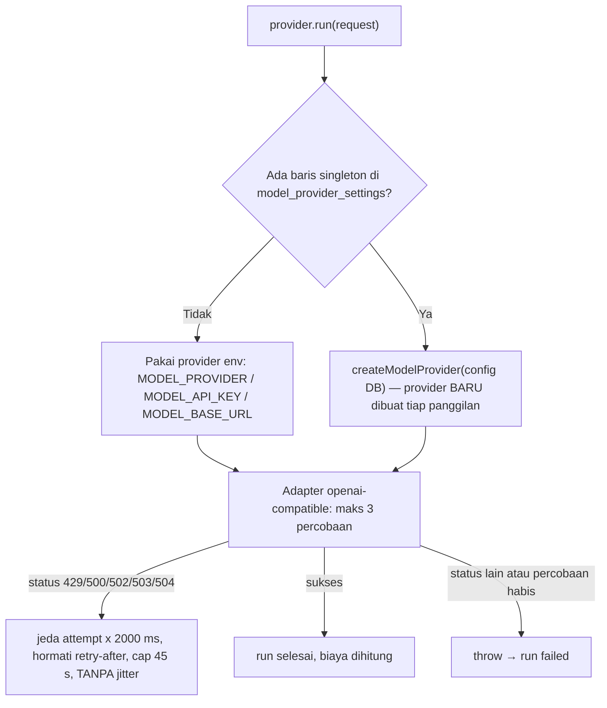

# ⚡ AI Model Provider Landscape

Lanskap penyedia inferensi LLM di **ATLAS AI OS**: provider apa saja yang dikenali kode, bagaimana runtime memilih provider saat inferensi, bagaimana *rate limit* ditangani, dan apa yang benar-benar terbukti di database per **16 Sep 2026**.

> **Niat desain:** satu titik konfigurasi model yang bisa diganti tanpa me-restart proses (agent-service dan worker berbagi baris konfigurasi yang sama), plus adapter multi-provider dan retry otomatis terhadap kuota.

---

## 🌐 Enum Provider yang Benar

Daftar provider **bukan** daftar bebas — nilainya divalidasi Zod lewat `ModelProviderSchema` (`packages/shared/src/schemas/config.ts:4`):

| `MODEL_PROVIDER` (enum) | Yang terbukti di repo / DB |
| :--- | :--- |
| `mock` | Dikenali enum. Tidak ada baris DB maupun run yang memakainya. |
| `openai` | Dikenali enum. Tidak ada bukti pemakaian. |
| `openai-compatible` | Adapter generik ada di `packages/providers/src/openai.ts`; perilaku retry di bawah berasal dari adapter ini. Tidak ada bukti dipakai langsung oleh deployment saat ini. |
| `openrouter` | **Satu-satunya provider aktif** (baris DB, snapshot 16 Sep 2026). Satu-satunya subclass yang menulis tarif eksplisit — dan tarifnya nol. Provider lain memakai default kelas dasar bersama: **0.15 / 0.6 per juta token** (`packages/providers/src/openai.ts:33-34`), `mock` memakai `0.0015` per 1.000 token (`packages/providers/src/mock.ts:25`). |
| `groq` | Dikenali enum. Tidak ada bukti pemakaian di DB. |
| `ollama` | Dikenali enum. Dipakai layanan embedding Second Brain sebagai opsi (`packages/memory/src/second-brain/vector-embedding-service.ts:62-80`), **dan** factory juga memetakannya sebagai provider chat — `[OI]CompatibleProvider` ke `http://localhost:11434/v1` dengan `requireApiKey: false` (`packages/providers/src/factory.ts:41-47`). Deployment ini tidak terbukti memakainya untuk chat. |
| `deepseek` | Dikenali enum. Tidak ada bukti pemakaian di DB. |

Default env `MODEL_PROVIDER` = **`openrouter`** (`packages/shared/src/schemas/config.ts:33`) — bukan Groq seperti yang sering dikutip di dokumen lain.

---

## 🗄️ Konfigurasi Aktif (snapshot 16 Sep 2026)

Runtime membaca **satu baris singleton** dari tabel `model_provider_settings` (`WHERE id='singleton'`). Isinya saat snapshot:

| Field | Nilai |
| :--- | :--- |
| `provider` | `openrouter` |
| `model_name` | `minimax/minimax-m3:free` |
| `updated_at` | `2026-09-03T19:56:48Z` |

Tiga dokumen repo menyebut model default yang berbeda-beda: `.env.example:30` dan `packages/shared/src/model.ts:2` memakai `minimax/minimax-m3:free`, `README.md:86-88` menyebut Groq `openai/gpt-oss-120b`, `docs/RUNBOOK.md:75` menyebut `z-ai/glm-5.2:free`. **Yang berlaku saat ini adalah baris DB di atas.**

---

## 🔀 Bagaimana Provider Benar-Benar Dipilih

Provider dari env dibungkus `ReloadableModelProvider` saat komposisi runtime (`packages/runtime/src/index.ts:94`):

Konsekuensi nyata dari cabang "Ya":

- Karena baris DB **ada**, `ReloadableModelProvider` membuat instance provider baru pada setiap panggilan (`packages/providers/src/reloadable.ts:26-30`). Artinya `MODEL_BASE_URL` dari env **diabaikan** selama baris DB ada.
- Cabang "Tidak" hanya terjadi bila baris DB kosong; itulah satu-satunya "fallback" yang ada, dan wujudnya persis satu baris kode: `config ? createModelProvider(config) : this.fallback` (`packages/providers/src/reloadable.ts:27-28`).
- `estimateCost` selalu didelegasikan ke provider env (`packages/providers/src/reloadable.ts:22-24`), bukan ke provider DB — relevan untuk temuan biaya di bawah.

---

## 🛡️ Retry & Rate Limit (mekanisme nyata, `packages/providers/src/openai.ts:103-143`)

1. **`maxRetries = 3`** (`:103`).
2. Retry hanya untuk status **`[429, 500, 502, 503, 504]`** (`:129`).
3. Jeda dasar: **`attempt * 2000 ms`** (`:130`) — jadi 2 s lalu 4 s, bukan 1 s/2 s/4 s.
4. Header `retry-after` dihormati: `Math.min(Math.ceil(nilai * 1000) + 500, 45000)` (`:131-136`).
5. Bila header tidak ada, regex `/try again in (\d+(?:\.\d+)?)s/i` dibaca dari body error, dengan rumus dan cap yang sama (`:138-142`).
6. **Plafon jeda 45 detik** (`:135`, `:142`) dan **tanpa jitter** — tidak ada komponen acak di kode.
7. Jalur kegagalan jaringan (`fetch` throw) memakai pola berbeda: `attempt * 1000 ms` (`:117-118`).
8. Retry habis / status di luar daftar → error dilempar; run berakhir `failed` dengan pesan yang menyebut status HTTP (`:127`).

---

## 💸 Temuan Biaya (krusial)

`OpenRouterProvider` menulis tarif nol secara eksplisit:

- `inputCostPerMillion: 0`, `outputCostPerMillion: 0` (`packages/providers/src/openrouter.ts:18-19`).

Akibat berantai yang terbukti di DB:

| Klaim | Bukti |
| :--- | :--- |
| Sejak 3 Sep setiap run berbiaya **$0.0000** | Hanya **10 dari 106** run punya `cost_usd > 0`, semuanya 31 Agu ($0.0045) dan 1 Sep ($0.0085) — yaitu sebelum baris singleton ditulis (3 Sep). |
| Plafon biaya keras per-run tidak pernah menyala | `if (totalCostUsd >= maxCostUsd) throw` (`packages/orchestration/src/engine/agent-runner.ts:361-364`) — pembilangnya selalu 0. |
| Anggaran harian global tidak pernah menyala | `GLOBAL_DAILY_BUDGET_USD` default **5.0** (`packages/shared/src/schemas/config.ts:63`), bukan $10. Baris `budgets` `global_daily` ada 4 hari (29 Agu, 1 Sep, 3 Sep, 4 Sep) dengan limit 5.0 dan terpakai `0.0044 / 0.0086 / 0 / 0`. |
| Mesin reservasi anggaran sendiri konsisten | 106 run → 104 reservation `committed` + 2 `released`; `SUM(runs.cost_usd)` = **$0.0130** sama dengan nilai ledger. |

Plafon per agent yang dipakai runner (`maxCostUsd`): `chief` 1.0 (`packages/agents/src/definitions/chief.ts:24`), `ned` 0.75 (`ned.ts:35`), `luna` 0.75 (`luna.ts:30`), `layla` 0.5 (`layla.ts:29`), `hermes` 0.5 (`hermes.ts:29`), `argus` 0.35 (`argus.ts:32`).

---

## 🚨 Kegagalan Nyata (36 run gagal)

| Penyebab | Jumlah |
| :--- | :--- |
| `OpenRouter HTTP 401 "User not found"` (kredensial) | 15 |
| `MODEL_API_KEY_MISSING` (kredensial) | 12 |
| `HTTP 429` dari adapter `openai-compatible` (retry habis) | 3 |
| `Worker lease expired` | 2 |
| HTTP 402 / 429 / 502 masing-masing | 1 |
| Input tool `memory.search` tidak valid | 1 |

**27 dari 36 kegagalan adalah kegagalan kredensial** — bukan masalah pemilihan model atau kuota. Sisanya adalah verdict QA yang sah (`SCOPE MISMATCH`, `CRITICAL SCOPE MISMATCH`, `Truncated content`).

---

## 🧊 Status Runtime (16 Sep 2026)

| Aspek | Yang benar-benar berjalan |
| :--- | :--- |
| Resolusi provider | **Berjalan.** Baris singleton `model_provider_settings` dibaca setiap panggilan; provider baru dibuat per panggilan (`packages/providers/src/reloadable.ts:26-30`). |
| Retry | **Berjalan**, tetapi hampir tak berguna pada kegagalan kredensial: 401/402 tidak ada di daftar status yang di-retry (`packages/providers/src/openai.ts:129`). |
| Reservasi anggaran | **Berjalan dan konsisten**: 104 reservation `committed` + 2 `released`, `SUM(runs.cost_usd)` $0.0130 = nilai ledger. |
| Plafon biaya per-run & harian | **Inert.** Tarif provider nol (`packages/providers/src/openrouter.ts:18-19`) ⇒ pembilang selalu $0.0000 sejak 3 Sep, sehingga `packages/orchestration/src/engine/agent-runner.ts:361-364` dan `GLOBAL_DAILY_BUDGET_USD` (`packages/shared/src/schemas/config.ts:63`) tidak pernah menyala. |
| Kredensial | **Rusak.** 27 dari 36 kegagalan run adalah kredensial (401 ×15, `MODEL_API_KEY_MISSING` ×12). |
| Aktivitas platform | Jendela data run berakhir `2026-09-03T20:23Z`; 106 run (70 completed / 36 failed), 55 task (40 completed / 10 failed / 5 macet di `running`). Platform praktis idle sejak 3 Sep. |

---

## ❌ Yang TIDAK Ada di Sistem (koreksi klaim lama)

- **Tidak ada rantai fallback otomatis antar model maupun antar provider.** Satu-satunya percabangan adalah "baris DB ada / tidak" di atas.
- **`fallbackTier`** pada definisi agent **tidak dibaca kode mana pun**.
- **Tidak ada jitter** pada backoff (lihat bagian retry).
- **Tidak ada klaim pemasaran** soal kecepatan perangkat keras atau jumlah model per provider yang bisa diverifikasi dari repo ini; tabel di atas sengaja dibatasi pada enum, kode, dan baris DB.
- **Tidak ada rute `/api/v1/brain/rag`** maupun provider vektor: penyimpanan vektor `pgvector` tidak terpasang di DB — lihat [[Personal Knowledge & Memory Protocol]].

---

## 🔗 Tautan Terkait

- [[040 - Knowledge Base & Rubrics MOC]]
- [[Personal Knowledge & Memory Protocol]]
- [[Local Development Setup]]
- [[Observability & Audit Trail]]
- [[Policy, Security & Approval Gates]]

---

⬅️ Kembali ke [[000 - Home MOC]]
