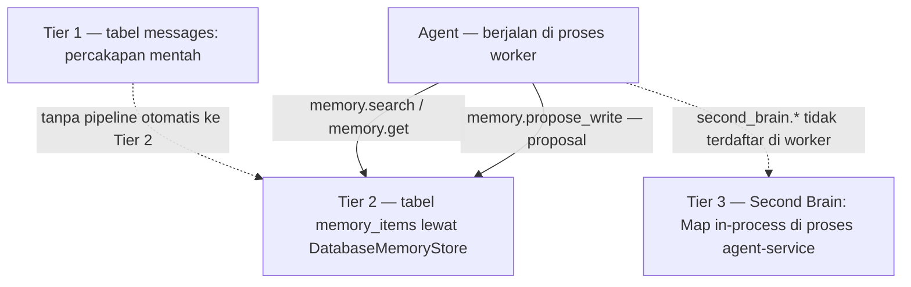

# 🧠 Personal Knowledge & Memory Protocol

Protokol pengelolaan ingatan personal AI, pembagian tier memori, serta aturan privasi dan retensi data pada **ATLAS AI OS**.

> **Niat desain:** tiga tingkat memori yang saling melengkapi — percakapan mentah (Tier 1), fakta terverifikasi berumur panjang (Tier 2), dan pengetahuan vault yang bisa dikutip (Tier 3).

---

## 🏛️ Tiga Tingkatan Memori (Three-Tier Memory Architecture)

### 1. Tier 1: Short-Term Memory (Percakapan Aktif)

- Disimpan di tabel **`messages`** — bukan `conversation_messages`.
- Pesan intake ditulis **dalam satu transaksi** bersama task-nya, sehingga pesan tidak pernah "menggantung" tanpa task (`apps/agent-service/src/routes/tasks.ts:142-158`).
- Isi snapshot 16 Sep 2026: **266 baris** `messages`.
- Setiap pesan yang terbit dipublikasikan sebagai event `message.created` lewat `event_outbox` + `pg_notify('atlas_events', ...)` (`packages/events/src/bus.ts:63-82`).

### 2. Tier 2: Long-Term Memory (Fakta & Preferensi)

- Dikelola `DatabaseMemoryStore` yang dipasang di composition root runtime (`packages/runtime/src/index.ts:110`); versi in-memory hanya untuk test (`packages/memory/src/store/memory-store.ts:22`).
- Backing store-nya tabel **`memory_items`**.
- Tool yang tersedia bagi agent: **`memory.search`**, **`memory.get`**, **`memory.propose_write`** (`packages/tools/src/tools/memory-tools.ts:8,40,53`). Penulisan bersifat *proposal* — item memori berstatus belum terverifikasi sampai disetujui.
- Pencarian difilter per scope; scope diberikan per definisi agent (contoh `chief`: `global`, `business_knowledge`, `approved_research`, `second_brain` — `packages/agents/src/definitions/chief.ts:43`), dan deskripsi tool menegaskan scope yang tidak berhak tidak boleh terekspos (`memory-tools.ts:8-10`).
- Siklus hidup diatur konfigurasi: `MEMORY_MAINTENANCE_INTERVAL_SECONDS` default **3600** (`packages/shared/src/schemas/config.ts:55`) dan `MEMORY_DELETION_GRACE_DAYS` default **7** (`config.ts:62`). Pekerjaan perawatan dijalankan `MemoryMaintenanceService` di worker (`apps/worker/src/worker.ts:113`).
- **Catatan penting:** kredensial **tidak** disimpan di sini. Kunci provider disimpan terenkripsi di tabel `model_provider_settings.encrypted_api_key` (lihat bagian privasi).

### 3. Tier 3: Second Brain (Knowledge Base)

- Sumbernya catatan Markdown di `vault/`, dihubungkan Obsidian wiki-link `[[...]]` dan tag hierarkis.
- **Penyimpanan indeksnya adalah `Map` di dalam memori proses**, bukan PostgreSQL dan bukan `pgvector`: `private documents = new Map<...>()` dan `private chunks = new Map<...>()` (`packages/memory/src/second-brain/vault-ingestion-service.ts:25-26`).
- `SecondBrainService` **hanya diinstansiasi di agent-service** (`apps/agent-service/src/server.ts:324-326`), dan agent-service auto-ingest vault saat boot (`server.ts:348`).
- Embedding dihitung `VectorEmbeddingService` lewat Ollama atau cloud embedding bila kunci tersedia; bila tidak, vektor deterministik dipakai sebagai fallback (`packages/memory/src/second-brain/vector-embedding-service.ts:62-80`).
- Pencarian memakai skor hibrida `0.6*vector + 0.3*lexical + min(0.1, titleBonus)` (`packages/memory/src/second-brain/second-brain-retriever.ts:70`).
- Endpoint nyata: `POST /api/v1/brain/ingest`, `GET /api/v1/brain/stats`, `GET /api/v1/brain/notes`, `GET /api/v1/brain/notes/:id`, `GET /api/v1/brain/search`, `POST /api/v1/brain/query`. **Tidak ada** `/api/v1/brain/rag`.

---

## 🧊 Status Runtime (16 Sep 2026)

| Klaim | Kenyataan |
| :--- | :--- |
| "Vektor disimpan di `pgvector`" | **Salah.** DB hidup punya **0 kolom bertipe `vector`**; ekstensi terpasang hanya `plpgsql` dan `uuid-ossp`. Penyebabnya `CREATE EXTENSION vector` dibungkus `DO $$ ... EXCEPTION WHEN OTHERS THEN NULL` sehingga gagal tanpa suara (`packages/database/src/migrations/001_initial_schema.sql:6-12`). `memory_embeddings.embedding` bertipe **`jsonb`** dan berisi 0 baris. |
| "Indeks durable / persisten" | **Salah.** Indeks Tier 3 hilang saat proses mati (in-process `Map`). Selain itu `GET /api/v1/brain/stats` selalu mengembalikan **`durable: true` hardcoded** (`apps/agent-service/src/routes/second-brain.ts:44,64,77`) — klaim yang tidak benar. |
| "Agent bisa memanggil `second_brain.*`" | **Tidak.** Tool `second_brain.search`, `second_brain.read_note`, `second_brain.list_notes`, `second_brain.query`, `second_brain.sync_vault` hanya eksis sebagai deklarasi allowlist di definisi agent (`packages/agents/src/definitions/chief.ts:30-34`). Worker mendaftarkan tool lain saja (`apps/worker/src/worker.ts:100-129`), dan nama `second_brain` tidak muncul sama sekali di worker. |
| "`pnpm brain:sync` memberi agent pengetahuan baru" | **Tidak.** Skrip itu mem-POST ke `/api/v1/brain/ingest` di agent-service (`scripts/sync-vault.mjs`), mengisi memori proses agent-service, sedangkan agent berjalan di proses worker. Dua proses berbeda ⇒ hasil sync tidak pernah terlihat oleh agent. |
| Tier 2 terisi? | **Kosong.** `memory_items` 0 baris dan `memory_embeddings` 0 baris. |
| Tool memori dipakai? | Hampir tidak. Dari seluruh 106 run, total `tool_calls` hanya **5**: `memory.search` ×3 (2 sukses, 1 gagal dengan `Invalid input for tool 'memory.search': expected array, received string`), `artifacts.write` ×1, `artifacts.read` ×1. `memory.get` dan `memory.propose_write` belum pernah dipanggil. |
| Konsekuensi | Lapisan memori **terdaftar dan berfungsi secara kode**, tetapi praktis belum pernah mengakumulasi pengetahuan nyata; agent saat ini tidak punya jalur akses ke Second Brain. |

---

## 🔒 Kebijakan Privasi & Sanitasi Data

1. **Local-First / Self-Hosted**: data memori dan vault berada di server lokal pengguna. Data hanya keluar dalam bentuk teks prompt yang dikirim ke endpoint inferensi pilihan.
2. **Rahasia Tidak Ditulis Mentah**: kunci API dan rahasia tidak disimpan sebagai teks mentah di Second Brain.
3. **Kunci provider terenkripsi di DB**: baris konfigurasi provider menyimpan kunci pada kolom `model_provider_settings.encrypted_api_key`, dienkripsi memakai `ENCRYPTION_KEY` (tersedia opsi fingerprint lewat `api_key_fingerprint`).
4. **Perhatian**: `PUT /api/v1/settings/telegram` menulis ulang berkas **`.env` di disk** (`apps/agent-service/src/server.ts:422-440`) — nilai token/allowlist berpindah ke berkas plaintext, bukan hanya ke state runtime.

---

## 🔗 Tautan Terkait

- [[040 - Knowledge Base & Rubrics MOC]]
- [[Second Brain & Grounded RAG]]
- [[Chief - System Orchestrator]]
- [[AI Model Provider Landscape]]
- [[Policy, Security & Approval Gates]]
- [[Observability & Audit Trail]]
- [[Monorepo Layout & Applications]]

---

⬅️ Kembali ke [[000 - Home MOC]]
